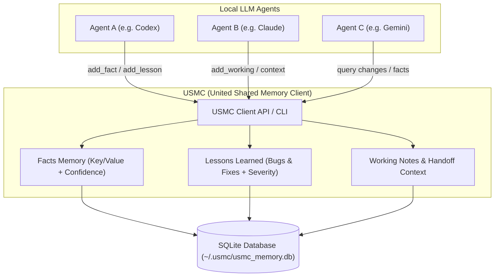

# USMC - United Shared Memory Client

[](https://github.com/ellmos-ai/usmc/actions/workflows/ci.yml)
[](LICENSE)
[](pyproject.toml)
[](tests)
[](llms.txt)

**Deutsch:** [README_de.md](README_de.md)

USMC is a zero-dependency Python memory layer for LLM agents. It gives multiple local agents one shared SQLite-backed memory for facts, lessons, working notes, sessions, and compact prompt context.

This repository is the ellmos project `ellmos-ai/usmc`, also described as **ellmos USMC** or **United Shared Memory Client** in search text. It is not related to the United States Marine Corps.

> [!NOTE]
> **ellmos USMC (United Shared Memory Client)** is the Tier 1 shared memory primitive for local LLM agents in the [ellmos AI ecosystem](https://github.com/ellmos-ai). It provides zero-dependency SQLite-backed persistence for facts, lessons learned, working notes, and prompt context without requiring a background daemon or cloud service.

## Start Here

| What | Where |
|---|---|
| Install | `pip install git+https://github.com/ellmos-ai/usmc.git` |
| Quick start | [Quick Start](#quick-start) below |
| CLI reference | `usmc --help` |
| German README | [README_de.md](README_de.md) |
| Tests | `python -m pytest -q` |
| Changelog | [CHANGELOG.md](CHANGELOG.md) |
| Issues / feedback | [GitHub Issues](https://github.com/ellmos-ai/usmc/issues) |

## Why It Exists

LLM agent projects often lose context between runs or duplicate notes across tools. USMC keeps the memory part small and reusable:

- Store persistent facts with confidence scores.
- Record lessons as problem/solution patterns.
- Keep session-scoped working notes.
- Track agent sessions and handoff notes.
- Generate compact context blocks for prompts.
- Share one local SQLite database across different agents.

USMC is Tier 1 of the ellmos family. Rinnsal and BACH build larger orchestration layers on top, but USMC stays focused on memory only.

### Architecture & Data Flow



## Install

From GitHub:

```bash
pip install git+https://github.com/ellmos-ai/usmc.git
```

From a local checkout:

```bash
pip install -e .
```

There is no PyPI release yet, and the name `usmc` is currently unclaimed on PyPI
(no project of that name exists there as of 2026-08-08). Until a first release is
published, use the GitHub install form above and do not assume that a `pip install usmc`
from PyPI would install this project.

## Quick Start

```python
from usmc import USMCClient

client = USMCClient(agent_id="codex")

client.add_fact("project", "framework", "FastAPI", confidence=0.9)
client.add_lesson(
    title="Windows encoding",
    problem="Python subprocess output used cp1252",
    solution="Run with PYTHONIOENCODING=utf-8",
    severity="high",
)
client.add_working("Currently preparing a release checklist")

print(client.generate_context())
```

High-level API:

```python
from usmc import api

api.init(agent_id="claude")
api.remember("repo", "ellmos-ai/usmc")
api.note("Audit README and package metadata")
api.lesson("Marketing check", "No search visibility", "Use ellmos-usmc wording")

print(api.status())
print(api.context())
```

CLI:

```bash
usmc status
usmc fact project framework FastAPI --confidence 0.9
usmc note "Current task: release polish"
usmc lesson "Encoding bug" "cp1252 output" "Set PYTHONIOENCODING=utf-8" --severity high
usmc context
usmc changes "2026-02-28T00:00:00" --json
```

> [!NOTE]
> **Command names and options are English, but the CLI messages, `--help` texts and the
> headings produced by `generate_context()` are currently German.** The library API itself is
> language-neutral; only the user-facing output is not. Switching the runtime output to English
> is still an open decision, because it changes behaviour for existing users and touches the
> test suite. Until then, expect German output strings.

## Idempotent Lessons (schema v2)

The original `add_lesson(title, problem, solution, ...)` call remains append-only. A lesson enters
the provenance-aware v2 contract only when both `source_key` and `episode_key` are supplied. That
pair is unique across the database and identifies one immutable intake payload. An identical
retry returns the original row; a different semantic, provenance or protection payload fails
closed without changing it. Content changes need a new `episode_key`, while editorial changes use
the review surface. The current editorial status, counters, delivery state and calculated/current
weight are deliberately outside the immutable intake hash. New keyed lessons start with a
deliberately low weight of `0.20`.

```python
lesson = client.add_lesson(
    "Windows encoding",
    "A subprocess returned cp1252",
    "Set PYTHONIOENCODING=utf-8",
    source_key="hook:codex",
    episode_key="session-42:encoding",
    event_anchor="tool-result:17",
    evidence_class="verified",
    privacy_scope="local",
)

client.set_lesson_editorial_status(lesson["id"], "approved")
delivered = client.deliver_lessons(
    session_key="session-43",
    delivery_key="session-43:start",
    context="Windows subprocess encoding",
    limit=3,
)
client.record_lesson_feedback(
    lesson["id"],
    feedback_key="session-43:lesson-1",
    helpful=True,
    delivery_key="session-43:start",
)
```

Feedback stores helpful/unhelpful use, independent repetition and delivery failure as separate,
idempotent signals. A `feedback_key` is globally exactly-once; reusing it for another lesson or
payload fails closed. An independent repetition can therefore remain useful evidence while also
being marked as a possible delivery failure. Delivery is synchronous and request-driven: without
an explicit context or selected lesson IDs, nothing is shown; one request returns at most three
approved (or legacy), local/private and non-sensitive lessons, each with the short question
`War diese Lesson hilfreich? (ja/nein)`. Retrying the same `delivery_key` replays only its stored
delivery rows in their original order, without reselection or another `times_shown` increment.
SessionStart persists the session and its delivery in one SQLite transaction.

The direct-promotion surface is policy evaluation only. `evaluate_lesson_promotion()` accepts only
verified, fully provenanced agent lessons from local/private sources. User preferences, policy
content, conflicts, sensitive sources and any skill/workflow mutation always require review. The
product gate defaults to off, and the method never publishes or mutates a skill, workflow or
editorial status.

Equivalent CLI paths are available:

```bash
usmc lesson "Encoding" "cp1252" "Use UTF-8" \
  --source-key hook:codex --episode-key session-42:encoding \
  --event-anchor tool-result:17 --evidence-class verified --json
usmc lesson-review 1 approved
usmc lesson-deliver --session-key session-43 --delivery-key session-43:start \
  --context "Windows encoding" --json
usmc lesson-feedback 1 --feedback-key session-43:lesson-1 \
  --helpful yes --delivery-key session-43:start --json
usmc lesson-policy 1
```

Opening a v1 database with the new client performs an additive, transactional migration to v2.
The migration is retry-safe, verifies required v2 columns/tables/indexes even when the stored
version already says v2, and preserves every old column and row. Unsafe global feedback-key
duplicates stop the transaction with a clear error instead of being deleted. Old clients can
continue to read and append lessons because all v2 fields have compatible defaults; rollback means
running the old client against the expanded database, not contracting or deleting the schema.

## Finding Things Again

Once several agents write to the same database, a chronological list stops being useful: a busy
loop can produce hundreds of notes a day, and every other reader has to scroll past them.
`working`, `facts` and `lessons` therefore take filters.

```bash
usmc working --tags store                  # one tag
usmc working --tags store,release          # comma = OR
usmc working --tags store,release --tags-all   # ... --tags-all makes it AND
usmc working --agent codex-cli             # only this agent's notes
usmc working --grep "Partner Center"       # substring in the content

usmc facts   --grep store                  # substring in key or value
usmc facts   --agent codex-cli
usmc lessons --grep cp1252                 # substring in title, problem or solution
usmc lessons --agent codex-cli --severity high
```

Same filters through the library and the high-level API:

```python
client.get_working(tags="store,release", tags_all=True, agent_id="codex-cli", grep="wave")
api.working(tags="store")
api.facts(grep="store")
api.lessons(grep="cp1252")
```

Four properties are worth knowing, because they decide whether a search finds anything:

- **Filters run in the SQL query, before `--limit`.** `--tags store -l 10` returns the ten best
  *store* notes, not the store notes among the ten most recent ones.
- **A tag matches only as a whole list entry.** `--tags rh` does not match `research`; the column
  is compared delimiter-anchored. Spacing does not matter, `a,b` and `a, b` behave the same.
- **Filters combine with AND.** `--tags store --agent codex-cli` means both conditions.
- **Case is ignored for ASCII only.** SQLite has no Unicode case folding without ICU, so `Store`
  and `store` match, but `Größe` and `GRÖSSE` do not. `%` and `_` in a `--grep` term are taken
  literally, not as wildcards.

`--tags` exists on `working` only — it is the sole table with a tags column. Untagged notes never
match a tag filter.

> [!TIP]
> **USMC holds process state, not subject-matter status.** What a project currently *is* belongs in
> its canonical register (for example `releases.json` or `APP-REGISTER.md` for the store pipeline);
> USMC records where a run stopped and what the next step is. When you search here and find
> nothing, check the register before concluding the information does not exist.
> By convention the **first tag of a note names the pipeline**, which is what makes
> `--tags store` a reliable entry point.

## Core Concepts

| Concept | What it stores | Typical use |
|---|---|---|
| Facts | Persistent key/value knowledge with confidence | Project facts, system facts, user preferences |
| Lessons | Reusable problem/solution records with severity | Bugs, operational rules, workflow fixes |
| Working memory | Temporary active notes | Current task state and scratchpad context |
| Sessions | Start/end records with handoff notes | Cross-agent continuity |
| Changes | Pollable update stream | Lightweight sync between agents |

## Multi-Agent Example

```python
from usmc import USMCClient

codex = USMCClient(db_path="shared.db", agent_id="codex")
claude = USMCClient(db_path="shared.db", agent_id="claude")

codex.add_fact("project", "status", "needs docs", confidence=0.7)
claude.add_fact("project", "status", "docs ready", confidence=0.95)

print(codex.get_facts(category="project"))
```

Confidence merging applies per agent: when the same agent rewrites a fact, the
higher-confidence value wins. Different agents keep separate rows for the same
key; `get_facts()` returns all of them sorted by confidence (highest first).

## Default Database Location

Without an explicit `db_path`, USMC stores its database per system under
`~/.usmc/usmc_memory.db` (created on first use). Override the location with
the `USMC_DB` environment variable or an explicit `db_path=` / `--db` argument.
This keeps the database out of your project folder and out of cloud-synced
working directories.

## Database Schema

- `usmc_facts` - persistent facts with confidence scores
- `usmc_lessons` - lessons learned with severity
- `usmc_lesson_feedback` - idempotent helpful/repeat/delivery-failure signals
- `usmc_lesson_delivery_batches` - request-level delivery idempotency
- `usmc_lesson_deliveries` - bounded contextual or selected deliveries
- `usmc_working` - temporary notes, context, scratchpad
- `usmc_sessions` - agent session tracking
- `usmc_meta` - internal schema version

The database is plain SQLite. There is no daemon, broker, cloud service, or external runtime dependency.

## Positioning

USMC is deliberately smaller than full agent platforms:

| Project type | Scope | USMC role |
|---|---|---|
| Agent frameworks | Tools, planning, orchestration, execution | Add shared memory underneath |
| Chat assistants | Conversation loop and UI | Store durable knowledge outside chat history |
| MCP servers | Tool exposure over protocol | Use USMC as local memory backend |
| BACH / Rinnsal | ellmos orchestration layers | USMC is the reusable memory primitive |

## Development

```bash
python -m pytest -q
python -m compileall -q usmc tests
python -m build
```

## Related Projects

- [Rinnsal](https://github.com/ellmos-ai/rinnsal) - compact ellmos orchestration layer
- [BACH](https://github.com/ellmos-ai/bach) - full text-based LLM operating system
- [ellmos-stack](https://github.com/ellmos-ai/ellmos-stack) - deployment and ecosystem context

## License

MIT License - Copyright (c) 2026 Lukas Geiger

## Liability

This project is an unpaid open-source donation. Liability is limited to intent and gross negligence under Section 521 German Civil Code. Use at your own risk. No warranty, no maintenance guarantee, and no fitness-for-purpose promise are provided.
