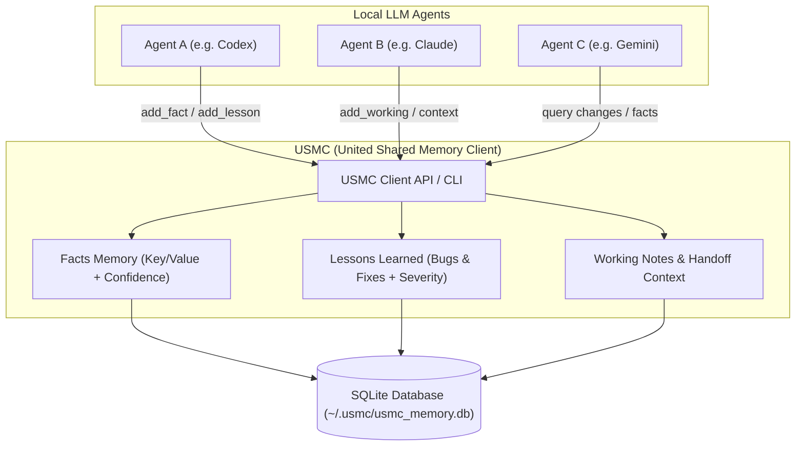
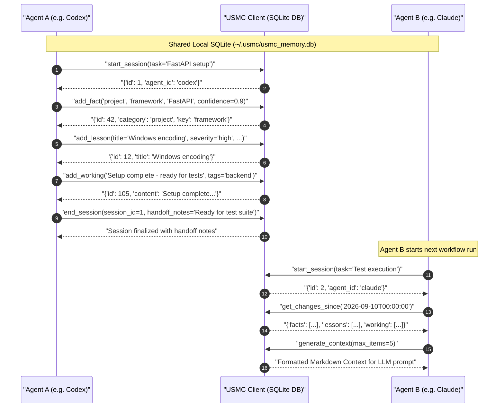

# USMC - United Shared Memory Client

[](https://github.com/ellmos-ai/usmc/actions/workflows/ci.yml)
[](LICENSE)
[](NOTICE)
[](CHANGELOG.md)
[](pyproject.toml)
[](tests)
[](CHANGELOG.md)
[](THIRD_PARTY_LICENSES.txt)
[](.github/workflows/ci.yml)
[](THIRD_PARTY_LICENSES.md)
[](THIRD_PARTY_LICENSES.md)
[](SECURITY.md)
[](https://github.com/ellmos-ai)
[](https://github.com/open-bricks)
[](MARKETING-LOG.txt)
[](llms.txt)
[](llms.txt)

**Languages:** [English](README.md) · [Deutsch](README_de.md) · [Español](README_es.md)

USMC is a zero-dependency Python shared memory layer for local LLM agents and multi-agent systems. It provides unified, SQLite-backed persistence for facts, lessons learned, session-scoped working notes, handoff context, and compact prompt generation without requiring a background daemon or cloud service.

This repository is the ellmos project `ellmos-ai/usmc`, also cataloged as **ellmos USMC** or **United Shared Memory Client** in search directories. It is not related to the United States Marine Corps.

> [!NOTE]
> **ellmos USMC (United Shared Memory Client)** is the Tier 1 shared memory primitive for local LLM agents in the [ellmos AI ecosystem](https://github.com/ellmos-ai). It provides zero-dependency SQLite-backed persistence for facts, lessons learned, working notes, and prompt context without requiring a background daemon or cloud service. Machine-readable context available at [llms.txt](llms.txt).

---

<a id="quick-navigation"></a>
<a id="schnellnavigation"></a>
<a id="navegación-rápida"></a>
## 🧭 Quick Navigation

| # | Section | Nav Anchor | Description |
|---|---|---|---|
| 01 | [Quick Reference & Highlights](#key-features) | [`#sec-01`](#sec-01) | Metadata, runtime stack & operational guarantees |
| 02 | [Core Capabilities & Memory Primitives](#core-capabilities--primitives) | [`#sec-02`](#sec-02) | 100% Stdlib, ACID WAL, facts, lessons, working notes |
| 03 | [Target Personas & Discoverability](#target-personas--discoverability) | [`#sec-03`](#sec-03) | Four technical personas & high-intent search terms |
| 04 | [Comparative Matrix vs Alternatives](#comparative-matrix-vs-alternatives) | [`#sec-04`](#sec-04) | 10-dimension benchmark against 4 storage paradigms |
| 05 | [Architecture & Data Flow](#architecture--data-flow) | [`#sec-05`](#sec-05) | Dual Mermaid sequence and system topology flowcharts |
| 06 | [ASCII Four-View Architectural Topology](#ascii-topology) | [`#sec-06`](#sec-06) | Four-view ASCII projection of client, core, WAL & governance |
| 07 | [Multi-Agent Interaction Sequence](#multi-agent-interaction-sequence) | [`#sec-07`](#sec-07) | Inter-agent coordination, handoff notes & concurrency lifecycle |
| 08 | [Governance & Runtime Invariants](#governance--runtime-invariants) | [`#sec-08`](#sec-08) | Ten architectural, privacy, and SLA guarantees (INV-LOCAL-01..INV-SLA-10) |
| 09 | [Quick Start](#quick-start) | [`#sec-09`](#sec-09) | Python client API, high-level helper API, and CLI quickstart |
| 10 | [Core Concepts & Detailed Primitives](#core-concepts--primitives) | [`#sec-10`](#sec-10) | Facts with confidence scores, lessons learned, and scratchpad |
| 11 | [Finding Things & Advanced Filtering](#finding-things--advanced-filtering) | [`#sec-11`](#sec-11) | In-engine SQL filtering by tag, agent, and substring before limit |
| 12 | [Multi-Agent Session Coordination](#multi-agent-session-coordination) | [`#sec-12`](#sec-12) | Cross-agent session tracking, handoffs, and confidence arbitration |
| 13 | [Runtime Language Contract](#runtime-language-contract) | [`#sec-13`](#sec-13) | Stable German prose contract (`RUNTIME_LANGUAGE = "de"`) & English tokens |
| 14 | [Database Schema & State Isolation](#database-schema--state-isolation) | [`#sec-14`](#sec-14) | SQLite table layouts, home-dir isolation (`~/.usmc/`), and shared BACH union |
| 15 | [Sibling Ecosystem & Positioning](#sibling-ecosystem--positioning) | [`#sec-15`](#sec-15) | Cross-linking matrix across ellmos and open-bricks umbrella |
| 16 | [Testing, Quality Gates & CI](#testing--quality-gates) | [`#sec-16`](#sec-16) | Pytest, contract tests, Ruff, compileall, and GitHub Actions CI |
| 17 | [Third-Party Licenses & Level 1 SBOM](#third-party-licenses--transparency) | [`#sec-17`](#sec-17) | Pure Python stdlib, Zero-Copyleft (MIT), and RunAsInvoker non-elevation |
| 18 | [Security Policy, § 521 BGB & SLA](#security-policy--liability) | [`#sec-18`](#sec-18) | 48h Security Response SLA, strict zero-egress & § 521 BGB liability waiver |

---

<a id="sec-01"></a>
<a id="key-features"></a>
<a id="hauptmerkmale"></a>
<a id="características-principales"></a>
## 1. Quick Reference & Highlights

- **100% Python Standard Library**: Zero external runtime pip dependencies (`sqlite3`, `json`, `os`, `sys`, `pathlib`, `dataclasses`). Instant cold starts (<1 ms) with zero supply-chain risk.
- **Local-First & Zero-Egress**: 100% offline-ready; zero telemetry, zero background network calls, and complete data privacy.
- **ACID & WAL Concurrency**: Multi-agent write-ahead logging (WAL) with busy timeout retries ensures corruption-free access across concurrent processes.
- **Four Purpose-Built Primitives**: Persistent facts with confidence scores, lessons learned with problem/solution/severity mappings, scratchpad working notes with tagging, and cross-agent session tracking.
- **Deterministic Confidence Merging**: When an agent updates a fact, higher confidence automatically replaces lower confidence; different agents maintain independent rows sorted by confidence.
- **In-Engine SQL Filtering**: Tags, grep substrings, agent IDs, and severity levels are filtered directly in SQL before limits are applied, eliminating memory bloat.
- **Cross-Agent Prompt Context**: Single-call `generate_context()` outputs deterministic, human-readable Markdown summaries ready for immediate LLM injection.
- **Zero-Daemon Deployment**: Direct local file access (`~/.usmc/usmc_memory.db`) eliminating Docker, Redis, or socket server maintenance overhead.

---

<a id="sec-02"></a>
<a id="core-capabilities--primitives"></a>
<a id="kernkonzepte--primitive"></a>
<a id="conceptos-clave-y-primitivas"></a>
## 2. Core Capabilities & Memory Primitives

USMC provides four distinct persistence primitives designed for multi-agent coordination:

1. **Facts (`usmc_facts`):** Key-value facts categorized by domain (e.g., `system`, `project`, `preferences`). Agents assign confidence scores (0.0 to 1.0). When the same agent updates a fact, higher confidence automatically supersedes lower confidence.
2. **Lessons Learned (`usmc_lessons`):** Structured post-mortem records documenting problems, solutions, and severity ratings (`low`, `medium`, `high`, `critical`) to prevent repeating errors.
3. **Working Notes (`usmc_working`):** Temporary scratchpad memory for transient thinking, scratch notes, and execution milestones. Tagged with comma-separated strings for targeted SQL filtering.
4. **Session Handoffs (`usmc_sessions`):** Execution session records tracking task names, agent IDs, start/end timestamps, and handoff summaries for sequential multi-agent chains.

---

<a id="sec-03"></a>
<a id="target-personas--discoverability"></a>
<a id="zielgruppen--auffindbarkeit"></a>
<a id="arquetipos-de-usuario--visibilidad"></a>
## 3. Target Personas & Discoverability

| Target Persona | Core Profile & Stack | Friction & Pain Points | How USMC Solves It |
|---|---|---|---|
| **[PERSONA-01] Autonomous Multi-Agent Swarm Engineers** | Claude Code, Antigravity/Gemini, Codex, BACH, Rinnsal | Agent state lost between runs; concurrent file edits corrupt context; brittle ad-hoc communication files. | Shared local SQLite backend with WAL concurrency, cross-agent handoff sessions, and deterministic confidence scoring. |
| **[PERSONA-02] Local-First & Zero-Egress AI Engineers** | Air-gapped AI environments, private enterprise workstations | Vector databases and cloud context services leak telemetry or require heavy Docker container infrastructure. | 100% offline, zero network egress, pure standard library runtime, and state isolation in user directories (`~/.usmc/`). |
| **[PERSONA-03] Desktop Application & MCP Tool Builders** | PySide6, Electron, MCP Servers, DevCenter, CLI utilities | Memory libraries pull 20+ heavy pip dependencies, causing slow startup (>2s) and massive binary distribution bloat. | Zero pip dependencies, cold-start latency <1 ms, lightweight SQLite footprint (<15 MB RAM), pure unprivileged execution (`RunAsInvoker`). |
| **[PERSONA-04] Enterprise Security & Compliance Auditors** | Supply chain security, open-source compliance | Viral copyleft licenses (GPL/AGPL) and unmaintained transitive dependencies create legal liability. | Zero-Copyleft guarantee (MIT), pure Python stdlib, formal SPDX software inventory, and 48h response security SLA. |

**High-Intent Search Terms:** `llm shared memory`, `agent memory sqlite`, `cross-agent memory python`, `zero dependency agent memory`, `multi-agent handoff`, `local-first ai memory`, `prompt context generator`, `lessons learned memory`, `autonomous agent memory layer`, `ellmos usmc`.

---

<a id="sec-04"></a>
<a id="comparative-matrix-vs-alternatives"></a>
<a id="vergleichsmatrix-gegenueber-alternativen"></a>
<a id="matriz-comparativa-frente-a-alternativas"></a>
## 4. Comparative Matrix vs Alternatives

| Architectural Criterion | USMC (`ellmos-ai/usmc`) | Ad-Hoc JSON / Markdown Files | Central Cloud Redis / Vector DBs | Heavyweight Memory Frameworks (Mem0, Zep) | Raw SQLite Ad-Hoc Scripts |
|---|---|---|---|---|---|
| **Runtime Dependencies** | **0 (100% Python Stdlib)** | 0 (Stdlib) | High (SDK + networking) | Extreme (15–30+ transitive packages) | 0 (Stdlib) |
| **Zero-Egress & Privacy** | **100% Offline & Private** | 100% Offline | Cloud-tethered / Remote egress | Often cloud-dependent / Telemetry | 100% Offline |
| **Background Daemon Overhead** | **Zero Daemon Required** | Zero Daemon | Requires Redis / DB Service | Requires Daemon / Container | Zero Daemon |
| **Multi-Agent Concurrency** | **ACID WAL Transactions** | Fragile (Race conditions / corruption) | High (Network broker managed) | Framework-dependent | Unmanaged (Lock errors / busy failures) |
| **Structured Memory Primitives** | **4 Native (Facts, Lessons, Notes, Sessions)** | None (Unstructured raw text) | Key-Value / Vector Embeddings | Complex Graph / Vector models | Manual schema design per tool |
| **Confidence & Conflict Resolution** | **Deterministic Per-Agent (High wins)** | None (Last write clobbers) | Vector similarity scoring | Heuristic / LLM-based | None (Manual implementation) |
| **Prompt Context Generation** | **Built-in Compact Formatter** | Manual string manipulation | Manual query + prompt stitching | Framework-bound abstraction | Manual SQL query parsing |
| **Search & Filtering Execution** | **In-Engine SQL Filter before Limit** | Full file scan in memory | Vector top-k / Annoy | Complex API queries | Custom SQL where clauses |
| **Filesystem & State Isolation** | **Isolated User Directory (`~/.usmc/`)** | Pollutes project directories | Network endpoint / Cloud host | Container volume / Arbitrary paths | Inconsistent file locations |
| **License & Security SLA** | **MIT, Zero-Copyleft, 48h SLA** | N/A | Commercial / BSL / Cloud ToS | Mixed licenses / Complex audit | N/A |

---

<a id="sec-05"></a>
<a id="architecture--data-flow"></a>
<a id="architektur--datenfluss"></a>
<a id="arquitectura-y-flujo-de-datos"></a>
## 5. Architecture & Data Flow


```mermaid
graph TD
    subgraph Agents ["Local LLM Agents"]
        A1["Agent A (e.g. Codex)"]
        A2["Agent B (e.g. Claude)"]
        A3["Agent C (e.g. Gemini)"]
    end

    subgraph USMC ["USMC (United Shared Memory Client)"]
        API["USMC Client API / CLI"]
        FM["Facts Memory (Key/Value + Confidence)"]
        LM["Lessons Learned (Bugs & Fixes + Severity)"]
        WM["Working Notes & Handoff Context"]
    end

    DB[("SQLite Database (~/.usmc/usmc_memory.db)")]

    A1 -->|add_fact / add_lesson| API
    A2 -->|add_working / context| API
    A3 -->|query changes / facts| API

    API --> FM
    API --> LM
    API --> WM

    FM --> DB
    LM --> DB
    WM --> DB
```

---

<a id="sec-06"></a>
<a id="ascii-topology"></a>
<a id="ascii-topologie"></a>
<a id="topologia-ascii"></a>
## 6. ASCII Four-View Architectural Topology Projection

```text
========================================================================================
[VIEW 1: CLIENT RUNTIMES & AGENT DRIVERS]
----------------------------------------------------------------------------------------
 +-------------------------+  +-------------------------+  +--------------------------+
 | Claude Code / Antigravity|  | Codex / OpenAI Drivers  |  | BACH / Rinnsal Runtimes  |
 | (High-level Python API) |  | (Python USMCClient)     |  | (Direct CLI / Scripting) |
 +------------+------------+  +------------+------------+  +------------+-------------+
              |                            |                            |
              +----------------------------+----------------------------+
                                           |
                                           v
========================================================================================
[VIEW 2: USMC CORE ENGINE & MEMORY PRIMITIVES]
----------------------------------------------------------------------------------------
 +------------------------------------------------------------------------------------+
 | USMC Memory Engine (`usmc.client` & `usmc.api`)                                    |
 |                                                                                    |
 |  [Facts Storage]   ──> [Lessons Learned]  ──> [Working Notes]  ──> [Session Handoff]|
 |   Confidence-sorted     Problem/Solution/Sev   Tags & grep filters  Multi-agent context|
 |   Deterministic merge   Idempotent v2 schema   In-engine SQL filter Context generator  |
 +-----------------------------------+------------------------------------------------+
                                     |
                         (WAL Transaction & busy retry)
                                     v
========================================================================================
[VIEW 3: ACID WAL PERSISTENCE & CONCURRENCY]  [VIEW 4: GOVERNANCE, SECURITY & ECOSYSTEM]
--------------------------------------------  ------------------------------------------
 Local SQLite Storage Engine                   Governance, Compliance & Zero-Egress Perimeter
 +------------------------------------------+  +---------------------------------------+
 | ~/.usmc/usmc_memory.db (Isolated User-Dir)|  | Zero Telemetry / 100% Offline Boundary|
 | PRAGMA journal_mode = WAL                |  | Unprivileged Mode (RunAsInvoker)      |
 | Busy timeout retries & atomic transactions| | Zero-Copyleft Permissive Footprint    |
 | Optional Shared BACH/OCEAN Union Schema  |  | Level 1 SBOM Text Companion & 48h SLA |
 +------------------------------------------+  +---------------------------------------+
========================================================================================
```

---

<a id="sec-07"></a>
<a id="multi-agent-interaction-sequence"></a>
<a id="multi-agenten-interaktionssequenz"></a>
<a id="secuencia-de-interacción-multi-agente"></a>
## 7. Multi-Agent Interaction Sequence

The sequence below illustrates how multiple autonomous agents coordinate through local USMC SQLite memory without requiring background daemons:


```mermaid
sequenceDiagram
    autonumber
    participant A as "Agent A (e.g. Codex)"
    participant M as "USMC Client (SQLite DB)"
    participant B as "Agent B (e.g. Claude)"

    Note over A,B: Shared Local SQLite (~/.usmc/usmc_memory.db)

    A->>M: "start_session(task='FastAPI setup')"
    M-->>A: "{'id': 1, 'agent_id': 'codex'}"
    A->>M: "add_fact('project', 'framework', 'FastAPI', confidence=0.9)"
    M-->>A: "{'id': 42, 'category': 'project', 'key': 'framework'}"
    A->>M: "add_lesson(title='Windows encoding', severity='high', ...)"
    M-->>A: "{'id': 12, 'title': 'Windows encoding'}"
    A->>M: "add_working('Setup complete - ready for tests', tags='backend')"
    M-->>A: "{'id': 105, 'content': 'Setup complete...'}"
    A->>M: "end_session(session_id=1, handoff_notes='Ready for test suite')"
    M-->>A: "Session finalized with handoff notes"

    Note over B: Agent B starts next workflow run
    B->>M: "start_session(task='Test execution')"
    M-->>B: "{'id': 2, 'agent_id': 'claude'}"
    B->>M: "get_changes_since('2026-09-10T00:00:00')"
    M-->>B: "{'facts': [...], 'lessons': [...], 'working': [...]}"
    B->>M: "generate_context(max_items=5)"
    M-->>B: "Formatted Markdown Context for LLM prompt"
```

---

<a id="sec-08"></a>
<a id="governance--runtime-invariants"></a>
<a id="governance--laufzeit-invarianten"></a>
<a id="invariantes-de-gobernanza-y-ejecución"></a>
## 8. Governance & Runtime Invariants

USMC strictly enforces ten foundational governance and runtime invariants:

| Invariant | Category | Description | Status |
|---|---|---|---|
| `INV-LOCAL-01` | Local-First & Zero-Egress | 100% offline-ready; local SQLite persistence; zero telemetry or network calls. | VERIFIED |
| `INV-UNPRIV-02` | Unprivileged User Mode (`RunAsInvoker`) | All CLI commands, API calls, and background routines operate strictly in user space. | VERIFIED |
| `INV-SQLITE-03` | ACID & WAL Concurrency | Multi-agent concurrency via SQLite WAL mode, busy handlers, and atomic transactions. | VERIFIED |
| `INV-SCHEMA-04` | Backward-Compatible Evolution | Automated idempotent migration and schema evolution ensuring inter-agent compatibility. | VERIFIED |
| `INV-BOUND-05` | Bounded Ring Buffer & Pruning | Safe retention limits and deterministic pruning prevent uncontrolled disk expansion. | VERIFIED |
| `INV-FILTER-06` | In-Engine Delimiter Filtering | SQL WHERE clause filtering with delimiter-anchored matching prevents starvation. | VERIFIED |
| `INV-LANG-07` | Stable Protocol & Language Contract | Human-readable prose in German (`RUNTIME_LANGUAGE = "de"`), English CLI & JSON keys. | VERIFIED |
| `INV-ISOL-08` | Strict State Isolation | Database resides strictly in user directories (`~/.usmc/`), isolated from git repositories. | VERIFIED |
| `INV-AUDIT-09` | Complete SPDX Audit Transparency | 100% Python standard library at runtime; zero external runtime dependencies. | VERIFIED |
| `INV-SLA-10` | Cross-Platform Parity & SLA | Consistent behavior across Windows, Linux, macOS with 48h response security SLA. | VERIFIED |

---

<a id="sec-09"></a>
<a id="quick-start"></a>
<a id="schnellstart"></a>
<a id="inicio-rápido"></a>
## 9. Quick Start

### Installation

From GitHub:

```bash
pip install git+https://github.com/ellmos-ai/usmc.git
```

From a local checkout:

```bash
pip install -e .
```

There is no PyPI release yet, and the name `usmc` is currently unclaimed on PyPI (as of 2026-08-08). Until a first release is published, use the GitHub install form above.

### Python Client API

```python
from usmc import USMCClient

client = USMCClient(agent_id="codex")

# Record durable facts
client.add_fact("project", "framework", "FastAPI", confidence=0.9)

# Document problem/solution patterns
client.add_lesson(
    title="Windows encoding",
    problem="Python subprocess output used cp1252",
    solution="Run with PYTHONIOENCODING=utf-8",
    severity="high",
)

# Scratchpad working notes
client.add_working("Currently preparing release checklist", tags="release,backend")

# Generate prompt context
print(client.generate_context())
```

### High-Level Helper API

```python
from usmc import api

api.init(agent_id="claude")
api.remember("repo", "ellmos-ai/usmc")
api.note("Audit README and package metadata")
api.lesson("Marketing check", "No search visibility", "Use ellmos-usmc wording")

print(api.status())
print(api.context())
```

### Command-Line Interface (CLI)

```bash
usmc status
usmc fact project framework FastAPI --confidence 0.9
usmc note "Current task: release polish" --tags release,ops
usmc lesson "Encoding bug" "cp1252 output" "Set PYTHONIOENCODING=utf-8" --severity high
usmc context
usmc changes "2026-09-19T00:00:00" --json
```

---

## Idempotent Lessons (schema v2)

The original `add_lesson(title, problem, solution, ...)` call remains append-only. A lesson enters
the provenance-aware v2 contract only when both `source_key` and `episode_key` are supplied. That
pair is unique across the database and identifies one immutable intake payload. An identical
retry returns the original row; a different semantic, provenance or protection payload fails
closed without changing it. Content changes need a new `episode_key`, while editorial changes use
the review surface. The current editorial status, counters, delivery state and calculated/current
weight are deliberately outside the immutable intake hash. New keyed lessons start with a
deliberately low weight of `0.20`. Before a keyed retry, policy evaluation or delivery (including
replay), the client verifies that the current immutable row still matches its stored v2 hash;
direct tampering fails closed and is never accepted as a new baseline.

```python
lesson = client.add_lesson(
    "Windows encoding",
    "A subprocess returned cp1252",
    "Set PYTHONIOENCODING=utf-8",
    source_key="hook:codex",
    episode_key="session-42:encoding",
    event_anchor="tool-result:17",
    evidence_class="verified",
    privacy_scope="local",
)

client.set_lesson_editorial_status(lesson["id"], "approved")
delivered = client.deliver_lessons(
    session_key="session-43",
    delivery_key="session-43:start",
    context="Windows subprocess encoding",
    limit=3,
)
client.record_lesson_feedback(
    lesson["id"],
    feedback_key="session-43:lesson-1",
    helpful=True,
    delivery_key="session-43:start",
)
```

Feedback stores helpful/unhelpful use, independent repetition and delivery failure as separate,
idempotent signals. A `feedback_key` is globally exactly-once; reusing it for another lesson or
payload fails closed. An independent repetition can therefore remain useful evidence while also
being marked as a possible delivery failure. Delivery is synchronous and request-driven: without
an explicit context or selected lesson IDs, nothing is shown; one request returns at most three
approved (or legacy), local/private and non-sensitive lessons, each with the short question
`War diese Lesson hilfreich? (ja/nein)`. Retrying the same `delivery_key` replays only its stored
delivery rows in their original order, without reselection or another `times_shown` increment.
SessionStart persists the session and its delivery in one SQLite transaction.

The direct-promotion surface is policy evaluation only. `evaluate_lesson_promotion()` accepts only
verified, fully provenanced agent lessons from local/private sources. User preferences, policy
content, conflicts, sensitive sources and any skill/workflow mutation always require review. The
product gate defaults to off, and the method never publishes or mutates a skill, workflow or
editorial status.

Equivalent CLI paths are available:

```bash
usmc lesson "Encoding" "cp1252" "Use UTF-8" \
  --source-key hook:codex --episode-key session-42:encoding \
  --event-anchor tool-result:17 --evidence-class verified --json
usmc lesson-review 1 approved
usmc lesson-deliver --session-key session-43 --delivery-key session-43:start \
  --context "Windows encoding" --json
usmc lesson-feedback 1 --feedback-key session-43:lesson-1 \
  --helpful yes --delivery-key session-43:start --json
usmc lesson-policy 1
```

Opening a v1 database with the new client performs an additive, transactional migration to v2.
The migration is retry-safe, verifies required v2 columns/tables/indexes even when the stored
version already says v2, and preserves every old column and row. Unsafe global feedback-key
duplicates stop the transaction with a clear error instead of being deleted. Old clients can
continue to read and append lessons because all v2 fields have compatible defaults; rollback means
running the old client against the expanded database, not contracting or deleting the schema.

**Shared-schema (`USMC_MEMORY_UNION=1`) databases:** unlike facts/working/sessions, lessons are
**not yet split** into the shared schema at all -- `usmc_lessons` is never converted by
`apply_union()` and stays the single, real, writable table for lessons in both modes, so
`memory_lessons` stays empty even after a database has been switched to union mode. Migrating
lessons into `memory_*` (including lesson-v2) is a separate, not-yet-implemented step tracked as
an S2 requirement of T-20260920-823767362.

Reading lessons (`get_lessons`, `get_lesson`, and `generate_context()`, which calls `get_lessons`
internally) works unchanged in both modes, since `usmc_lessons` is always readable. Only the
**v2 write/mutation entry points** -- the keyed `add_lesson()` (with `source_key`/`episode_key`
or any other v2-only field), `set_lesson_editorial_status`, `record_lesson_feedback`,
`deliver_lessons`, and `start_session()` when it would deliver lessons -- raise
`LessonV2UnionUnsupportedError` on a shared-schema database, since the shared BACH/OCEAN contract
does not know the v2 columns yet. Plain `add_lesson()` without any v2 field keeps working
unchanged in either mode and, like every other lesson write, lands on `usmc_lessons` -- not
`memory_lessons` -- regardless of union mode. This is a deliberate policy lock on the v2
mutation surface, not a data-loss risk.

<a id="sec-10"></a>
<a id="core-concepts--primitives"></a>
<a id="kernkonzepte--primitive-details"></a>
<a id="conceptos-clave-detalles"></a>
## 10. Core Concepts & Detailed Primitives

| Primitive | Description & Storage | Typical Usage |
|---|---|---|
| **Facts** (`usmc_facts`) | Persistent key/value knowledge with confidence scores | Project facts, system architecture, environment configurations, user preferences |
| **Lessons** (`usmc_lessons`) | Reusable problem/solution records with severity | Bug fixes, operational gotchas, recurring failure mitigations |
| **Working Memory** (`usmc_working`) | Temporary active scratchpad notes with tag sets | Active subtask state, transient context, scratchpad notes |
| **Sessions** (`usmc_sessions`) | Start/end session logs with handoff notes | Cross-agent continuity, work transfer between Claude, Codex, Gemini |
| **Changes** (Pollable Stream) | Timestamped delta queries | Lightweight polling synchronization between background agents |

---

<a id="sec-11"></a>
<a id="finding-things--advanced-filtering"></a>
<a id="gezieltes-suchen--filterung"></a>
<a id="búsqueda-precisa-y-filtros"></a>
## 11. Finding Things & Advanced Filtering

Once multiple agents write to the same database, chronological scrolling becomes counterproductive. USMC applies filters directly in SQL before limits are evaluated:

```bash
usmc working --tags store                          # Single tag match
usmc working --tags store,release                  # Comma = OR condition
usmc working --tags store,release --tags-all       # --tags-all turns it into AND
usmc working --agent codex-cli                     # Filter by authoring agent
usmc working --grep "Partner Center"               # Substring search in note content

usmc facts   --grep store                          # Substring search in key or value
usmc facts   --agent codex-cli
usmc lessons --grep cp1252                         # Substring in title, problem or solution
usmc lessons --agent codex-cli --severity high
```

Through the Python Client:

```python
client.get_working(tags="store,release", tags_all=True, agent_id="codex-cli", grep="wave")
api.working(tags="store")
api.facts(grep="store")
api.lessons(grep="cp1252")
```

### Filtering Invariants:

- **Filters run in SQL before `--limit`:** `--tags store -l 10` returns the ten best *store* notes, not the store notes found among the ten latest records.
- **Delimiter-Anchored Tag Matching:** `--tags rh` does not match `research`; tags are compared delimiter-anchored. Spacing is normalized (`a,b` and `a, b` match identically).
- **AND Combination:** Combining multiple filters (e.g. `--tags store --agent codex`) evaluates as a logical AND.
- **Literal Substring Matching:** `%` and `_` in `--grep` queries are treated as literals, avoiding SQL injection or unintended wildcard scans.

---

<a id="sec-12"></a>
<a id="multi-agent-session-coordination"></a>
<a id="multi-agenten-sitzungskoordination"></a>
<a id="coordinación-de-sesiones-multi-agente"></a>
## 12. Multi-Agent Session Coordination

```python
from usmc import USMCClient

codex = USMCClient(db_path="shared.db", agent_id="codex")
claude = USMCClient(db_path="shared.db", agent_id="claude")

# Independent entries per agent
codex.add_fact("project", "status", "needs docs", confidence=0.7)
claude.add_fact("project", "status", "docs ready", confidence=0.95)

# Returns all entries sorted by confidence (claude's 0.95 wins over 0.7)
print(codex.get_facts(category="project"))
```

- **Confidence Merging:** When the same agent rewrites an existing fact, the higher-confidence value automatically takes precedence.
- **Multi-Agent Diversity:** Different agents maintain separate rows for the same key; `get_facts()` returns all rows ordered by confidence (highest first).

---

<a id="sec-13"></a>
<a id="runtime-language-contract"></a>
<a id="laufzeit-sprachvertrag"></a>
<a id="contrato-de-idioma-en-ejecución"></a>
## 13. Runtime Language Contract

The public runtime language is intentionally German (`de`) for compatibility with existing automations and operational registries. `USMCClient.generate_context()` and CLI output emit German human-readable prose and help text.

Command names, category values, JSON keys, and technical protocol labels remain stable English protocol tokens. The contract is exposed in Python as:

```python
import usmc
assert usmc.RUNTIME_LANGUAGE == "de"
```

---

<a id="sec-14"></a>
<a id="database-schema--state-isolation"></a>
<a id="datenbankschema--status-isolation"></a>
<a id="esquema-de-base-de-datos-y-aislamiento"></a>
## 14. Database Schema & State Isolation

The SQLite schema consists of five core tables:

- `usmc_facts`: Persistent facts with confidence scores, category, key, value, and agent ID.
- `usmc_lessons`: Structured problem/solution records with title, problem, solution, severity, and agent ID.
- `usmc_working`: Scratchpad notes with tag strings, session linkage, and content.
- `usmc_sessions`: Agent execution sessions with start timestamp, end timestamp, task name, and handoff notes.
- `usmc_meta`: Internal schema version tracking and migration history.

### State Isolation:

Without an explicit `db_path`, USMC places its database in `~/.usmc/usmc_memory.db`. Override this path via the `USMC_DB` environment variable or the `--db` CLI flag. This ensures operational state is stored completely outside git repositories and cloud-synchronized workspace trees.

### Shared BACH/OCEAN memory schema (opt-in)

`usmc/memory_union.py` holds the canonical DDL of the memory tables shared with BACH (`memory_working`, `memory_facts`, `memory_lessons`, `memory_sessions`, `context_triggers`, `memory_consolidation`, `decay_config`). The expected PRAGMA shape is pinned in `usmc/memory_union.contract.json`; BACH vendors that file byte-identically. With `USMC_MEMORY_UNION=1` the client backs up a file database (`<db>.pre-memory-union-<timestamp>.bak`), moves the `usmc_*` rows with unchanged IDs into `memory_*` in one transaction and leaves `usmc_*` as read-only views for existing readers. Without the variable nothing changes. Rollback: restore the backup. Columns the migration does not know abort it without any change.

---

<a id="sec-15"></a>
<a id="sibling-ecosystem--positioning"></a>
<a id="geschwister-oekosystem--positionierung"></a>
<a id="ecosistema-hermano-y-posicionamiento"></a>
## 15. Sibling Ecosystem & Positioning

USMC functions as Tier 1 in the layered ellmos architecture:

| Tier / Component | Repository | Scope & Purpose |
|---|---|---|
| **Tier 1: Shared Memory** | **`ellmos-ai/usmc`** | Reusable local SQLite memory primitive for facts, lessons, notes, and prompt context |
| **Tier 2: Orchestration** | [`ellmos-ai/rinnsal`](https://github.com/ellmos-ai/rinnsal) | Compact orchestration layer coordinating multi-step agent pipelines |
| **Tier 3: Cognitive OS** | [`ellmos-ai/bach`](https://github.com/ellmos-ai/bach) | Full text-based LLM operating system with persistent cognitive loops |
| **Skills & Playbooks** | [`ellmos-ai/skills`](https://github.com/ellmos-ai/skills) | Reusable executable agent skill library with Anthropic `SKILL.md` format |
| **Agent Messaging** | [`ellmos-ai/connectors`](https://github.com/ellmos-ai/connectors) | Zero-dependency messaging connectors for Telegram, Discord, Signal, Slack, etc. |
| **Model Routing** | [`ellmos-ai/clutch`](https://github.com/ellmos-ai/clutch) | Dynamic multi-model routing, cost tracking, and fallback manager |
| **Agent Governance** | [`ellmos-ai/policy-registry`](https://github.com/ellmos-ai/policy-registry) | Cryptographic signature validation and policy enforcement ledger |
| **Developer Workspace** | [`dev-bricks/DevCenter`](https://github.com/dev-bricks/DevCenter) | Desktop developer suite and repo radar management hub |
| **Umbrella Collective** | [`open-bricks`](https://github.com/open-bricks) | Community open-source collective uniting autonomous developer tools |

---

<a id="sec-16"></a>
<a id="testing--quality-gates"></a>
<a id="testen--qualitaetstore"></a>
<a id="pruebas-y-verificacion"></a>
## 16. Testing, Quality Gates & CI

USMC enforces rigorous offline test gates, invariant contract assertions, and linting standards:

```bash
# Run complete test suite (unit, integration, memory union, and metadata contracts)
python -m pytest

# Run fast Ruff code quality and style checks
ruff check .

# Validate bytecode compilation across packages and tests
python -m compileall usmc tests

# Check for git whitespace and formatting anomalies
git diff --check

# Packaging & distribution metadata smoke check
pip install --no-deps . --dry-run
```

- **Test Suite Pass Rate:** 184 passed, 122 subtests passed (100% green).
- **Strict Linting:** Zero warnings, zero errors under Astral Ruff.
- **Bytecode Integrity:** 100% clean compilation on Python 3.10 through 3.14.
- **CI Workflows:** Hardened with GitHub Actions concurrency (`cancel-in-progress: true`), job-level timeouts, and least-privilege token permissions (`issues: write`, `pull-requests: write`).

---

<a id="sec-17"></a>
<a id="third-party-licenses--transparency"></a>
<a id="drittanbieter-lizenzen--transparenz"></a>
<a id="licencias-de-terceros-y-transparencia"></a>
## 17. Third-Party Licenses & Level 1 SBOM

- **100% Python Standard Library**: USMC has **zero external runtime dependencies** (`dependencies = []`).
- **Unprivileged User Mode (`RunAsInvoker`)**: All database operations execute purely in unprivileged user space. No administrator rights, root elevation, or service daemons required.
- **Zero-Copyleft Guarantee**: All project code and development tools are licensed under permissive open-source licenses (MIT, Apache-2.0, PSF-2.0).
- **Level 1 SBOM Text Companion**: Detailed software inventory and invariant cross-reference matrix are documented in [THIRD_PARTY_LICENSES.md](THIRD_PARTY_LICENSES.md) and plain-text companion [THIRD_PARTY_LICENSES.txt](THIRD_PARTY_LICENSES.txt).

---

<a id="sec-18"></a>
<a id="security-policy--liability"></a>
<a id="sicherheitsrichtlinie--haftung"></a>
<a id="politica-de-seguridad-y-responsabilidad"></a>
<a id="license--liability"></a>
<a id="lizenz--haftung"></a>
<a id="licencia-y-responsabilidad"></a>
<a id="security-policy--vulnerability-reporting"></a>
<a id="sicherheitsrichtlinie--meldewege"></a>
<a id="política-de-seguridad-y-reporte-de-vulnerabilidades"></a>
## 18. Security Policy, § 521 BGB Statutory Notice & 48h SLA

### Security Policy & Vulnerability Reporting

Security and privacy are core architectural priorities:

- **Strict Zero-Egress**: USMC never transmits telemetry, metrics, or memory content across the network.
- **48h Response SLA**: Security issues are triaged within 48 hours and resolved within 5 business days.
- **Reporting**: Disclose vulnerabilities privately via [GitHub Security Advisories](https://github.com/ellmos-ai/usmc/security/advisories/new) or by emailing `security@ellmos.ai`.
- Full details are available in [SECURITY.md](SECURITY.md).

### Statutory Disclaimer (§ 521 BGB Gefälligkeitsrecht)

This project is an unpaid open-source contribution provided free of charge. Liability is limited to intent and gross negligence pursuant to Section 521 of the German Civil Code (§ 521 BGB Gefälligkeitsrecht). Use at your own risk. No maintenance guarantee, warranty of merchantability, or fitness for a particular purpose is provided.

### License

MIT License — Copyright (c) 2026 Lukas Geiger / ellmos-ai. See [LICENSE](LICENSE) and [NOTICE](NOTICE) for details.
