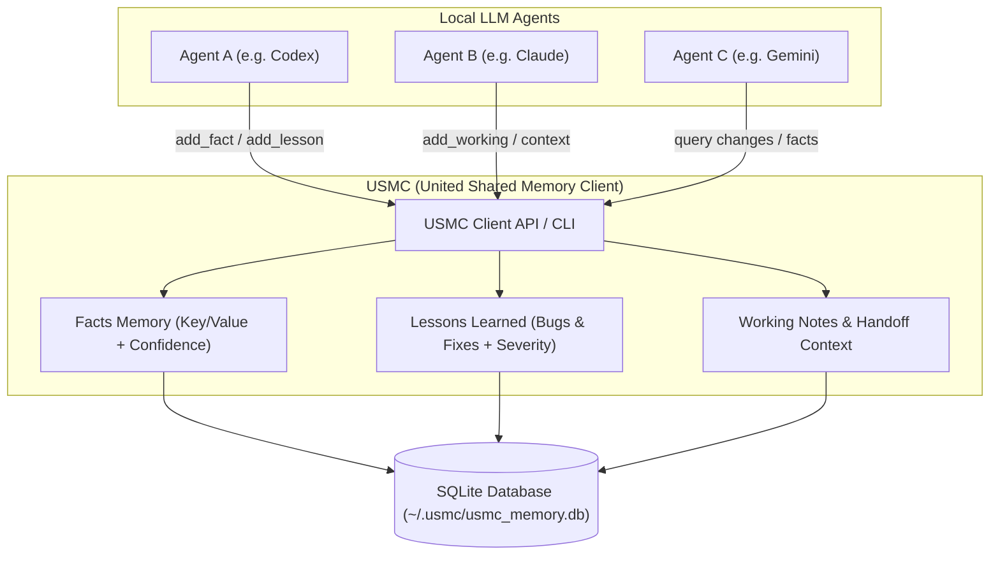

# USMC - United Shared Memory Client

[](https://github.com/ellmos-ai/usmc/actions/workflows/ci.yml)
[](LICENSE)
[](pyproject.toml)
[](tests)
[](llms.txt)

**English:** [README.md](README.md)

USMC ist eine Python-Speicherschicht ohne externe Abhängigkeiten für LLM-Agenten. Mehrere lokale Agenten teilen sich damit eine SQLite-basierte Erinnerung für Fakten, Lektionen, Arbeitsnotizen, Sitzungen und kompakten Prompt-Kontext.

Dieses Repository ist das ellmos-Projekt `ellmos-ai/usmc`, in Suchtexten auch **ellmos USMC** oder **United Shared Memory Client**. Es steht in keiner Beziehung zum United States Marine Corps.

> [!NOTE]
> **ellmos USMC (United Shared Memory Client)** ist die Tier-1-Speicherbasis für lokale LLM-Agenten im [ellmos AI Ökosystem](https://github.com/ellmos-ai). Es bietet ohne externe Laufzeitabhängigkeiten eine SQLite-basierte Persistenz für Fakten, gelernte Lektionen, Arbeitsnotizen und Prompt-Kontext — ohne Hintergrund-Daemon oder Cloud-Zwang.

## Hier beginnen

| Was | Wo |
|---|---|
| Installation | `pip install git+https://github.com/ellmos-ai/usmc.git` |
| Schnellstart | [Schnellstart](#schnellstart) weiter unten |
| CLI-Referenz | `usmc --help` |
| Englische README | [README.md](README.md) |
| Tests | `python -m pytest -q` |
| Änderungsprotokoll | [CHANGELOG.md](CHANGELOG.md) |
| Issues / Feedback | [GitHub Issues](https://github.com/ellmos-ai/usmc/issues) |

## Warum es USMC gibt

LLM-Agenten verlieren zwischen Läufen oft Kontext oder verteilen Notizen über mehrere Werkzeuge. USMC hält nur den Speicherteil klein und wiederverwendbar:

- Persistente Fakten mit Confidence-Werten speichern.
- Lektionen als Problem/Lösungs-Muster dokumentieren.
- Temporäre Arbeitsnotizen für eine Sitzung halten.
- Agenten-Sitzungen und Übergabenotizen nachvollziehen.
- Kompakte Kontextblöcke für Prompts erzeugen.
- Eine lokale SQLite-Datenbank zwischen Agenten teilen.

USMC ist Tier 1 der ellmos-Familie. Rinnsal und BACH bauen größere Orchestrierungsschichten darauf auf, während USMC bewusst nur Speicher bereitstellt.

### Architektur & Datenfluss



## Installation

Direkt von GitHub:

```bash
pip install git+https://github.com/ellmos-ai/usmc.git
```

Aus einem lokalen Checkout:

```bash
pip install -e .
```

Es gibt noch kein PyPI-Release, und der Name `usmc` ist auf PyPI derzeit nicht vergeben
(Stand 2026-08-08 existiert dort kein Projekt dieses Namens). Bis zum ersten Release bitte
die GitHub-Installation oben verwenden und nicht davon ausgehen, dass ein `pip install usmc`
von PyPI dieses Projekt installiert.

## Schnellstart

```python
from usmc import USMCClient

client = USMCClient(agent_id="codex")

client.add_fact("project", "framework", "FastAPI", confidence=0.9)
client.add_lesson(
    title="Windows encoding",
    problem="Python subprocess output used cp1252",
    solution="Run with PYTHONIOENCODING=utf-8",
    severity="high",
)
client.add_working("Currently preparing a release checklist")

print(client.generate_context())
```

High-Level API:

```python
from usmc import api

api.init(agent_id="claude")
api.remember("repo", "ellmos-ai/usmc")
api.note("Audit README and package metadata")
api.lesson("Marketing check", "No search visibility", "Use ellmos-usmc wording")

print(api.status())
print(api.context())
```

CLI:

```bash
usmc status
usmc fact project framework FastAPI --confidence 0.9
usmc note "Current task: release polish"
usmc lesson "Encoding bug" "cp1252 output" "Set PYTHONIOENCODING=utf-8" --severity high
usmc context
usmc changes "2026-02-28T00:00:00" --json
```

> [!NOTE]
> **Befehlsnamen und Optionen sind englisch, die CLI-Meldungen, `--help`-Texte und die von
> `generate_context()` erzeugten Überschriften sind derzeit deutsch.** Die Bibliotheks-API ist
> sprachneutral, die Ausgabe an den Nutzer nicht. Die Umstellung der Laufzeitausgabe auf Englisch
> ist eine noch offene Entscheidung, weil sie das Verhalten bestehender Nutzer ändert und die
> Testsuite berührt. Bis dahin sind deutsche Ausgabetexte zu erwarten.

## Kernkonzepte

| Konzept | Gespeicherter Inhalt | Typische Nutzung |
|---|---|---|
| Fakten | Persistentes Schlüssel/Wert-Wissen mit Confidence | Projektfakten, Systemfakten, Nutzerpräferenzen |
| Lektionen | Wiederverwendbare Problem/Lösungs-Einträge mit Schweregrad | Fehler, Betriebsregeln, Workflow-Fixes |
| Arbeitsgedächtnis | Temporäre aktive Notizen | Aktueller Aufgabenstand und Scratchpad-Kontext |
| Sitzungen | Start/Ende-Einträge mit Übergabenotizen | Kontinuität zwischen Agenten |
| Änderungen | Abfragbarer Änderungsstrom | Leichtgewichtige Synchronisierung |

## Multi-Agent-Beispiel

```python
from usmc import USMCClient

codex = USMCClient(db_path="shared.db", agent_id="codex")
claude = USMCClient(db_path="shared.db", agent_id="claude")

codex.add_fact("project", "status", "needs docs", confidence=0.7)
claude.add_fact("project", "status", "docs ready", confidence=0.95)

print(codex.get_facts(category="project"))
```

Der Confidence-Merge gilt pro Agent: Überschreibt derselbe Agent einen Fakt,
gewinnt der Wert mit höherer Confidence. Verschiedene Agenten behalten für
denselben Schlüssel getrennte Einträge; `get_facts()` liefert alle, sortiert
nach Confidence (höchste zuerst).

## Standard-Speicherort der Datenbank

Ohne explizites `db_path` speichert USMC die Datenbank pro System unter
`~/.usmc/usmc_memory.db` (wird bei erster Nutzung angelegt). Der Ort lässt
sich über die Umgebungsvariable `USMC_DB` oder explizit per `db_path=` /
`--db` übersteuern. So bleibt die Datenbank aus dem Projektordner und aus
cloud-synchronisierten Arbeitsverzeichnissen heraus.

## Datenbankschema

- `usmc_facts` - persistente Fakten mit Confidence-Werten
- `usmc_lessons` - gelernte Lektionen mit Schweregrad
- `usmc_working` - temporäre Notizen, Kontext, Scratchpad
- `usmc_sessions` - Agenten-Sitzungsverlauf
- `usmc_meta` - interne Schema-Version

Die Datenbank ist reines SQLite. Es gibt keinen Daemon, Broker, Cloud-Dienst oder externe Laufzeitabhängigkeit.

## Einordnung

USMC ist absichtlich kleiner als vollständige Agentenplattformen:

| Projekttyp | Umfang | Rolle von USMC |
|---|---|---|
| Agent-Frameworks | Tools, Planung, Orchestrierung, Ausführung | Gemeinsame Speicherschicht darunter |
| Chat-Assistenten | Gesprächsschleife und UI | Dauerhaftes Wissen außerhalb des Chatverlaufs |
| MCP-Server | Tool-Zugriff über Protokoll | Lokales Speicher-Backend |
| BACH / Rinnsal | ellmos-Orchestrierungsschichten | Wiederverwendbare Speicherbasis |

## Entwicklung

```bash
python -m pytest -q
python -m compileall -q usmc tests
python -m build
```

## Verwandte Projekte

- [Rinnsal](https://github.com/ellmos-ai/rinnsal) - kompakte ellmos-Orchestrierungsschicht
- [BACH](https://github.com/ellmos-ai/bach) - vollständiges textbasiertes LLM-Betriebssystem
- [ellmos-stack](https://github.com/ellmos-ai/ellmos-stack) - Deployment- und Ökosystemkontext

## Lizenz

MIT License - Copyright (c) 2026 Lukas Geiger

## Haftung

Dieses Projekt ist eine unentgeltliche Open-Source-Schenkung. Die Haftung des Urhebers ist gemäß § 521 BGB auf Vorsatz und grobe Fahrlässigkeit beschränkt.

Nutzung auf eigenes Risiko. Keine Wartungszusage, keine Verfügbarkeitsgarantie, keine Gewähr für Fehlerfreiheit oder Eignung für einen bestimmten Zweck.
