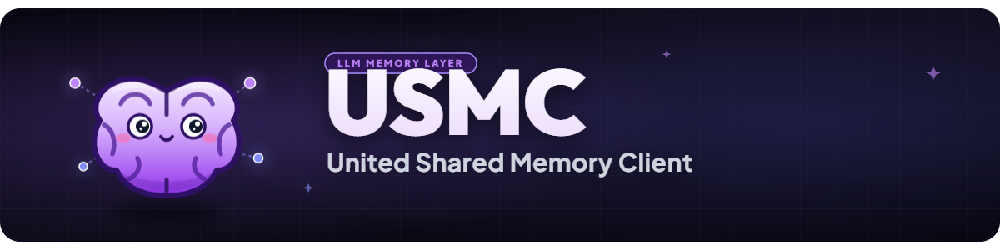
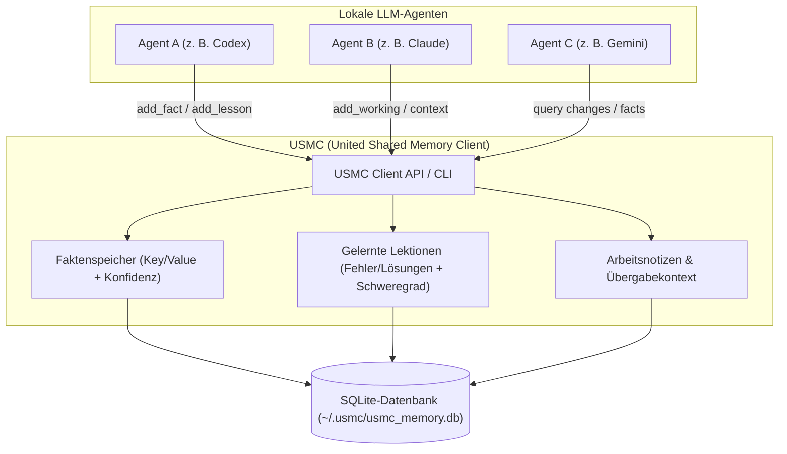
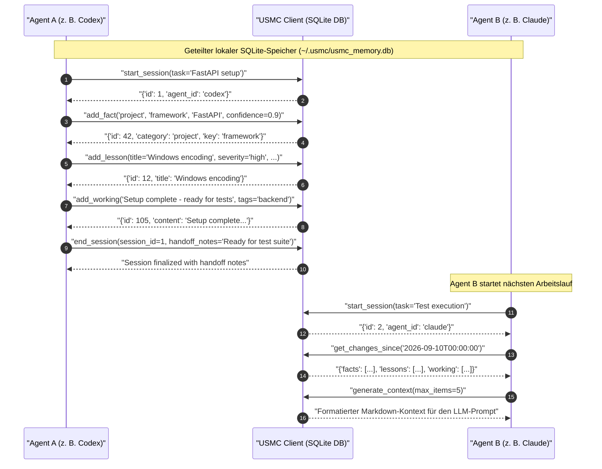

# USMC - United Shared Memory Client

[](https://github.com/ellmos-ai/usmc/actions/workflows/ci.yml)
[](LICENSE)
[](NOTICE)
[](CHANGELOG.md)
[](pyproject.toml)
[](tests)
[](CHANGELOG.md)
[](.github/workflows/ci.yml)
[](THIRD_PARTY_LICENSES.md)
[](THIRD_PARTY_LICENSES.md)
[](SECURITY.md)
[](https://github.com/ellmos-ai)
[](https://github.com/open-bricks)
[](MARKETING-LOG.txt)
[](llms.txt)

**Sprachen:** [English](README.md) · [Deutsch](README_de.md) · [Español](README_es.md)

USMC ist eine Python-Speicherschicht ohne externe Laufzeitabhängigkeiten für lokale LLM-Agenten und Multi-Agenten-Systeme. Es bietet eine einheitliche, SQLite-basierte Persistenz für Fakten, gelernte Lektionen, sitzungsbezogene Arbeitsnotizen, Übergabekontext und kompakte Prompt-Generierung ohne Hintergrund-Daemon oder Cloud-Dienst.

Dieses Repository ist das ellmos-Projekt `ellmos-ai/usmc`, in Katalogen und Suchmaschinen auch als **ellmos USMC** oder **United Shared Memory Client** geführt. Es steht in keiner Beziehung zum United States Marine Corps.

> [!NOTE]
> **ellmos USMC (United Shared Memory Client)** ist die Tier-1-Speicherbasis für lokale LLM-Agenten im [ellmos AI Ökosystem](https://github.com/ellmos-ai). Es bietet ohne externe Laufzeitabhängigkeiten eine SQLite-basierte Persistenz für Fakten, gelernte Lektionen, Arbeitsnotizen und Prompt-Kontext — ohne Hintergrund-Daemon oder Cloud-Zwang. Maschinenlesbarer Kontext verfügbar unter [llms.txt](llms.txt).

---

## Schnellnavigation

- [Hauptmerkmale](#hauptmerkmale)
- [Zielgruppen & Auffindbarkeit](#zielgruppen--auffindbarkeit)
- [Vergleichsmatrix gegenüber Alternativen](#vergleichsmatrix-gegenueber-alternativen)
- [Architektur & Datenfluss](#architektur--datenfluss)
- [Multi-Agenten Interaktionssequenz](#multi-agenten-interaktionssequenz)
- [Governance- & Laufzeit-Invarianten](#governance--laufzeit-invarianten)
- [Schnellstart](#schnellstart)
- [Kernkonzepte & Primitive](#kernkonzepte--primitive)
- [Gezieltes Suchen & Filterung](#gezieltes-suchen--filterung)
- [Multi-Agenten Sitzungskoordination](#multi-agenten-sitzungskoordination)
- [Laufzeit-Sprachvertrag](#laufzeit-sprachvertrag)
- [Datenbankschema & Status-Isolation](#datenbankschema--status-isolation)
- [Geschwister-Ökosystem & Positionierung](#geschwister-oekosystem--positionierung)
- [Drittanbieter-Lizenzen & Transparenz](#drittanbieter-lizenzen--transparenz)
- [Sicherheitsrichtlinie & Meldewege](#sicherheitsrichtlinie--meldewege)
- [Lizenz & Haftung](#lizenz--haftung)

---

## Hauptmerkmale

- **100% Python Standardbibliothek**: Null externe Pip-Laufzeitabhängigkeiten (`sqlite3`, `json`, `os`, `sys`, `pathlib`, `dataclasses`). Blitzschneller Kaltstart (<1 ms) ohne Supply-Chain-Risiken.
- **Local-First & Zero-Egress**: 100% offline-fähig; keinerlei Telemetrie, keine ungefragten Netzwerkverbindungen und garantierter lokaler Datenschutz.
- **ACID- & WAL-Nebenläufigkeit**: Multi-Agenten Write-Ahead Logging (WAL) mit automatischen Busy-Handler-Wiederholungen garantiert korruptionsfreien Datenzugriff bei parallelen Prozessen.
- **Vier maßgeschneiderte Primitive**: Persistente Fakten mit Confidence-Bewertung, gelernte Lektionen mit Problem/Lösung/Schweregrad, Arbeitsnotizen mit Tagging und sitzungsübergreifende Agenten-Übergaben.
- **Deterministische Confidence-Zusammenführung**: Aktualisiert derselbe Agent einen Fakt, überschreibt der höhere Konfidenzwert den niedrigeren; unterschiedliche Agenten behalten unabhängige Zeilen, sortiert nach Konfidenz.
- **Filterung direkt in der SQL-Engine**: Tags, Grep-Suchbegriffe, Agenten-IDs und Schweregrade werden vor dem Limit direkt per SQL gefiltert, was Speicherverschwendung verhindert.
- **Cross-Agent Prompt-Kontext**: Ein einziger Aufruf von `generate_context()` liefert kompakten, deterministischen Markdown-Kontext zur direkten Übergabe an LLMs.
- **Daemonfreier Betrieb**: Direkte lokale Dateipersistenz (`~/.usmc/usmc_memory.db`) ohne Docker-, Redis- oder Hintergrund-Server-Wartungsaufwand.

---

## Zielgruppen & Auffindbarkeit

| Zielgruppe / Persona | Profil & Tech-Stack | Typische Hürden & Pain Points | Lösung durch USMC |
|---|---|---|---|
| **Autonome Multi-Agenten-Entwickler** | Claude Code, Antigravity/Gemini, Codex, BACH, Rinnsal | Kontextverlust zwischen Agenten-Läufen; kollidierende Datei-Edits; fragile Ad-Hoc-Notizdateien. | Geteilte lokale SQLite-Datenbank mit WAL-Transaktionen, Sitzungsübergaben und Konfidenzabgleich. |
| **Local-First & Zero-Egress Systemingenieure** | Air-Gapped KI-Systeme, geschützte Entwickler-Workstations | Vektordatenbanken und Cloud-Dienste leiten Telemetrie aus oder verlangen schwere Docker-Container. | 100% Offline-Betrieb, null Netzwerk-Egress, reine Standardbibliothek und strikte Dateiisolation (`~/.usmc/`). |
| **Desktop-App- & MCP-Werkzeug-Entwickler** | PySide6, Electron, MCP-Server, DevCenter, CLI-Tools | Speicherbibliotheken ziehen 20+ schwere Pip-Pakete nach, verlangsamen den Start (>2s) und blähen Binaries auf. | Null externe Abhängigkeiten, <1 ms Kaltstart, minimaler RAM-Bedarf (<15 MB), unprivilegierter User-Mode (`RunAsInvoker`). |
| **Enterprise Security- & Compliance-Auditoren** | Lizenz-Governance, CVE-Lieferkettenprüfung | Virale Copyleft-Lizenzen (GPL/AGPL) und ungepflegte transitive Pakete bergen rechtliche und Sicherheitsrisiken. | Zero-Copyleft-Garantie (reines MIT/PSF-2.0), vollständiges SPDX-Softwareinventar und 48h-Sicherheits-SLA. |

**Relevante Suchbegriffe:** `llm geteilter speicher`, `agenten speicher sqlite`, `cross-agenten gedächtnis`, `ki agenten persistenz`, `lokale llm arbeitsnotizen`, `prompt kontext generator`, `lektionen speicher`, `python standardbibliothek speicher`, `multi-agenten handoff`, `ellmos usmc deutsch`.

---

## Vergleichsmatrix gegenüber Alternativen

| Kriterium | USMC (`ellmos-ai/usmc`) | Ad-Hoc JSON / Markdown-Dateien | Zentrale Cloud Redis / Vektor-DBs | Schwergewichtige Speicher-Frameworks (Mem0, Zep) | Eigene Ad-Hoc SQLite-Skripte |
|---|---|---|---|---|---|
| **Laufzeitabhängigkeiten** | **0 (100% Python Stdlib)** | 0 (Stdlib) | Hoch (SDK + Netzwerk) | Extrem (15–30+ Fremdpakete) | 0 (Stdlib) |
| **Zero-Egress & Datenschutz** | **100% Offline & Lokal** | 100% Offline | Cloud-gebunden / Externer Egress | Oft Cloud-abhängig / Telemetrie | 100% Offline |
| **Hintergrund-Daemon Overhead** | **Kein Daemon nötig** | Kein Daemon | Erfordert Redis / DB-Dienst | Erfordert Daemon / Container | Kein Daemon |
| **Multi-Agenten Nebenläufigkeit** | **ACID WAL-Transaktionen** | Fragil (Race Conditions / Dateibruch) | Hoch (Über Netzwerk-Broker) | Framework-abhängig | Unverwaltet (Lock-Fehler / Busy) |
| **Strukturierte Primitive** | **4 native (Fakten, Lektionen, Notizen, Sitzungen)** | Keine (Unstrukturierter Fließtext) | Key-Value / Vektoreinbettungen | Komplexe Graph-/Vektormodelle | Manuelles Schemadesign je Tool |
| **Konfidenz & Konfliktlösung** | **Deterministisch je Agent (Höchste gewinnt)** | Keine (Letzter Schreibzugriff gewinnt) | Vektorähnlichkeitsscore | Heuristisch / LLM-basiert | Keine (Manuelle Logik nötig) |
| **Prompt-Kontextgenerierung** | **Integrierter kompakter Formatierer** | Manuelle String-Konstruktion | Manuelle Abfrage + Prompt-Bau | An Framework-Bindung gekoppelt | Manuelle SQL-Abfrageverarbeitung |
| **Such- & Filterausführung** | **SQL-Filterung vor dem Limit** | Kompletter Dateiscan im Speicher | Vektor Top-k / Annoy | Komplexe API-Abfragen | Eigene SQL-Where-Klauseln |
| **Dateisystem- & Statusisolation** | **Isoliertes Benutzerverzeichnis (`~/.usmc/`)** | Verschmutzt Projektverzeichnisse | Netzwerk-Endpunkt / Cloud-Host | Container-Volume / Beliebige Pfade | Uneinheitliche Dateiorte |
| **Lizenz & Sicherheits-SLA** | **MIT, Zero-Copyleft, 48h SLA** | N/A | Kommerziell / BSL / Cloud-ToS | Gemischte Lizenzen / Audit-Risiko | N/A |

---

## Architektur & Datenfluss


```mermaid
graph TD
    subgraph Agents ["Lokale LLM-Agenten"]
        A1["Agent A (z. B. Codex)"]
        A2["Agent B (z. B. Claude)"]
        A3["Agent C (z. B. Gemini)"]
    end

    subgraph USMC ["USMC (United Shared Memory Client)"]
        API["USMC Client API / CLI"]
        FM["Faktenspeicher (Key/Value + Konfidenz)"]
        LM["Gelernte Lektionen (Fehler/Lösungen + Schweregrad)"]
        WM["Arbeitsnotizen & Übergabekontext"]
    end

    DB[("SQLite-Datenbank (~/.usmc/usmc_memory.db)")]

    A1 -->|add_fact / add_lesson| API
    A2 -->|add_working / context| API
    A3 -->|query changes / facts| API

    API --> FM
    API --> LM
    API --> WM

    FM --> DB
    LM --> DB
    WM --> DB
```

---

## Multi-Agenten Interaktionssequenz

Das folgende Sequenzdiagramm verdeutlicht, wie mehrere autonome Agenten (z. B. Codex und Claude) über die lokale USMC-SQLite-Datenbank ohne Hintergrund-Daemon synchronisieren und Aufgaben übergeben:


```mermaid
sequenceDiagram
    autonumber
    participant A as "Agent A (z. B. Codex)"
    participant M as "USMC Client (SQLite DB)"
    participant B as "Agent B (z. B. Claude)"

    Note over A,B: Geteilter lokaler SQLite-Speicher (~/.usmc/usmc_memory.db)

    A->>M: "start_session(task='FastAPI setup')"
    M-->>A: "{'id': 1, 'agent_id': 'codex'}"
    A->>M: "add_fact('project', 'framework', 'FastAPI', confidence=0.9)"
    M-->>A: "{'id': 42, 'category': 'project', 'key': 'framework'}"
    A->>M: "add_lesson(title='Windows encoding', severity='high', ...)"
    M-->>A: "{'id': 12, 'title': 'Windows encoding'}"
    A->>M: "add_working('Setup complete - ready for tests', tags='backend')"
    M-->>A: "{'id': 105, 'content': 'Setup complete...'}"
    A->>M: "end_session(session_id=1, handoff_notes='Ready for test suite')"
    M-->>A: "Session finalized with handoff notes"

    Note over B: Agent B startet nächsten Arbeitslauf
    B->>M: "start_session(task='Test execution')"
    M-->>B: "{'id': 2, 'agent_id': 'claude'}"
    B->>M: "get_changes_since('2026-09-10T00:00:00')"
    M-->>B: "{'facts': [...], 'lessons': [...], 'working': [...]}"
    B->>M: "generate_context(max_items=5)"
    M-->>B: "Formatierter Markdown-Kontext für den LLM-Prompt"
```

---

## Governance- & Laufzeit-Invarianten

USMC erzwingt strikt zehn fundamentale Governance- und Laufzeit-Invarianten:

| Invariante | Kategorie | Beschreibung | Status |
|---|---|---|---|
| `INV-LOCAL-01` | Local-First & Zero-Egress | 100% offline-fähig; lokale SQLite-Persistenz; keinerlei Telemetrie oder Netzwerkaufrufe. | VERIFIZIERT |
| `INV-UNPRIV-02` | Unprivilegierter User-Mode (`RunAsInvoker`) | Alle CLI-Befehle, API-Aufrufe und Routinen laufen strikt im unprivilegierten Benutzerraum. | VERIFIZIERT |
| `INV-SQLITE-03` | ACID & WAL Nebenläufigkeit | Multi-Agenten-Gleichzeitigkeit über SQLite WAL-Modus, Busy-Handler und atomare Transaktionen. | VERIFIZIERT |
| `INV-SCHEMA-04` | Abwärtskompatible Schemaevolution | Automatische idempotente Migrationen gewährleisten nahtlose Kompatibilität zwischen Agenten. | VERIFIZIERT |
| `INV-BOUND-05` | Begrenzter Ringpuffer & Bereinigung | Sichere Aufbewahrungsgrenzen und deterministisches Pruning verhindern unkontrolliertes Festplattenwachstum. | VERIFIZIERT |
| `INV-FILTER-06` | In-Engine Begrenzungsfilterung | SQL WHERE-Klauselfilterung mit trennzeichenverankertem Abgleich verhindert Speicherüberlauf. | VERIFIZIERT |
| `INV-LANG-07` | Stabiler Protokoll- & Sprachvertrag | Menschenlesbare Ausgaben auf Deutsch (`RUNTIME_LANGUAGE = "de"`), stabile englische CLI- & JSON-Tokens. | VERIFIZIERT |
| `INV-ISOL-08` | Strikte Status-Isolation | Die Datenbank verbleibt strikt im Benutzerverzeichnis (`~/.usmc/`), isoliert von Git-Repositories. | VERIFIZIERT |
| `INV-AUDIT-09` | Vollständige SPDX-Audittransparenz | 100% Python Standardbibliothek zur Laufzeit; null externe Laufzeitabhängigkeiten. | VERIFIZIERT |
| `INV-SLA-10` | Plattformparität & SLA | Einheitliches Verhalten unter Windows, Linux, macOS mit 48h Reaktionszeit-Sicherheits-SLA. | VERIFIZIERT |

---

## Schnellstart

### Installation

Über GitHub:

```bash
pip install git+https://github.com/ellmos-ai/usmc.git
```

Aus einem lokalen Repository-Checkout:

```bash
pip install -e .
```

Bislang existiert kein PyPI-Release; der Name `usmc` ist auf PyPI derzeit unbeansprucht (Stand: 2026-08-08). Bitte nutzen Sie bis zum offiziellen Release die GitHub-Installationsform.

### Python Client-API

```python
from usmc import USMCClient

client = USMCClient(agent_id="codex")

# Dauerhafte Fakten festhalten
client.add_fact("project", "framework", "FastAPI", confidence=0.9)

# Gelernte Problemlösungen dokumentieren
client.add_lesson(
    title="Windows encoding",
    problem="Python Subprozess-Ausgabe nutzte cp1252",
    solution="Ausführen mit PYTHONIOENCODING=utf-8",
    severity="high",
)

# Temporäre Arbeitsnotizen
client.add_working("Aktuell in Vorbereitung der Release-Checkliste", tags="release,backend")

# Prompt-Kontext erzeugen
print(client.generate_context())
```

### High-Level Helfer-API

```python
from usmc import api

api.init(agent_id="claude")
api.remember("repo", "ellmos-ai/usmc")
api.note("Audit von README und Paketmetadaten")
api.lesson("Marketing-Check", "Keine Suchsichtbarkeit", "ellmos-usmc Begriff nutzen")

print(api.status())
print(api.context())
```

### Kommandozeile (CLI)

```bash
usmc status
usmc fact project framework FastAPI --confidence 0.9
usmc note "Aktuelle Aufgabe: Release-Feinschliff" --tags release,ops
usmc lesson "Encoding-Fehler" "cp1252 Ausgabe" "Setze PYTHONIOENCODING=utf-8" --severity high
usmc context
usmc changes "2026-09-19T00:00:00" --json
```

---

## Idempotente Lektionen (Schema v2)

Der bisherige Aufruf `add_lesson(title, problem, solution, ...)` bleibt append-only. Eine Lektion
nutzt den provenance-fähigen v2-Vertrag erst, wenn `source_key` und `episode_key` gemeinsam
gesetzt sind. Dieses Paar ist datenbankweit eindeutig und bezeichnet genau einen unveränderlichen
Aufnahme-Payload. Ein identischer Retry liefert die ursprüngliche Zeile; ein abweichender Inhalt,
Provenienz- oder Schutzwert scheitert ohne Mutation. Inhaltliche Änderungen benötigen einen neuen
`episode_key`, redaktionelle Änderungen den Reviewpfad. Neue geschlüsselte Lektionen starten mit
dem niedrigen Gewicht `0.20`.

```python
lesson = client.add_lesson(
    "Windows-Kodierung",
    "Ein Subprozess lieferte cp1252",
    "PYTHONIOENCODING=utf-8 setzen",
    source_key="hook:codex",
    episode_key="session-42:encoding",
    event_anchor="tool-result:17",
    evidence_class="verified",
    privacy_scope="local",
)

client.set_lesson_editorial_status(lesson["id"], "approved")
delivered = client.deliver_lessons(
    session_key="session-43",
    delivery_key="session-43:start",
    context="Windows Subprozess Kodierung",
    limit=3,
)
client.record_lesson_feedback(
    lesson["id"],
    feedback_key="session-43:lesson-1",
    helpful=True,
    delivery_key="session-43:start",
)
```

Feedback speichert hilfreiche oder nicht hilfreiche Nutzung, unabhängige Wiederholung und
Zustellfehler als getrennte, idempotente Signale. Ein `feedback_key` gilt global genau einmal;
seine Wiederverwendung für eine andere Lektion oder einen anderen Payload scheitert. Eine
unabhängige Wiederholung kann damit
weiterhin Evidenz sein und zugleich als möglicher Zustellfehler markiert werden. Die Zustellung
ist synchron und an eine konkrete Anfrage gebunden: Ohne expliziten Kontext oder ausgewählte
Lesson-IDs wird nichts angezeigt. Eine Anfrage liefert höchstens drei freigegebene (oder alte),
lokale/private und nicht sensible Lektionen, jeweils mit der kurzen Frage
`War diese Lesson hilfreich? (ja/nein)`. Ein Retry desselben `delivery_key` rekonstruiert nur die
zuerst persistierten Zustellzeilen in stabiler Reihenfolge, ohne Neuselektion oder erneutes
Hochzählen von `times_shown`. SessionStart speichert Session und Zustellung in einer SQLite-
Transaktion.

Die Direct-Promotion-Oberfläche wertet ausschließlich eine Policy aus. Nur verifizierte,
vollständig provenienzbelegte Agenten-Lektionen aus lokalen/privaten Quellen können geeignet
sein. Nutzerpräferenzen, Policy-Inhalte, Konflikte, sensible Quellen sowie jede Skill- oder
Workflow-Mutation erfordern immer Review. Das Produktiv-Gate ist standardmäßig aus; die Methode
publiziert nichts und verändert weder Skills, Workflows noch Redaktionsstatus.

Dieselben Wege gibt es in der CLI:

```bash
usmc lesson "Kodierung" "cp1252" "UTF-8 verwenden" \
  --source-key hook:codex --episode-key session-42:encoding \
  --event-anchor tool-result:17 --evidence-class verified --json
usmc lesson-review 1 approved
usmc lesson-deliver --session-key session-43 --delivery-key session-43:start \
  --context "Windows-Kodierung" --json
usmc lesson-feedback 1 --feedback-key session-43:lesson-1 \
  --helpful yes --delivery-key session-43:start --json
usmc lesson-policy 1
```

Beim Öffnen einer v1-Datenbank führt der neue Client eine additive, transaktionale Migration auf
v2 aus. Sie ist retry-sicher, prüft erforderliche v2-Spalten, -Tabellen und -Indizes auch bei
bereits gespeicherter Version 2 und erhält jede alte Spalte und Zeile. Unsichere globale
Duplikate eines `feedback_key` brechen die Transaktion mit klarer Fehlermeldung ab, statt Daten zu
löschen. Alte Clients können weiterhin lesen und Lektionen anhängen, weil alle v2-Felder
kompatible Standardwerte besitzen. Rollback bedeutet, den alten Client gegen die erweiterte
Datenbank zu betreiben — nicht das Schema zu verkleinern oder Daten zu löschen.

**Datenbanken im gemeinsamen Schema (`USMC_MEMORY_UNION=1`):** Lesson-Schema v2 ist bewusst auf
`usmc_*` beschränkt und noch nicht Teil des gemeinsamen BACH/OCEAN-Vertrags. `add_lesson()` ohne
`source_key`/`episode_key` (und ohne sonstige v2-Felder) funktioniert unverändert in beiden
Modi; die geschlüsselte v2-API (`add_lesson` mit Schlüssel, `get_lessons`, `get_lesson`,
`set_lesson_editorial_status`, `record_lesson_feedback`, `deliver_lessons`) wirft auf einer
Datenbank im gemeinsamen Schema `LessonV2UnionUnsupportedError`. `usmc_lessons` selbst wird von
`apply_union()` nie konvertiert — bleibt eine reale, schreibbare Tabelle —, die Sperre ist also
eine bewusste Policy-Entscheidung, kein Risiko für Datenverlust.

## Kernkonzepte & Primitive

| Primitiv | Beschreibung & Speicherung | Typische Verwendung |
|---|---|---|
| **Fakten** (`usmc_facts`) | Dauerhaftes Key/Value-Wissen mit Konfidenzwert | Projektfakten, Systemkonfigurationen, Benutzereinstellungen |
| **Lektionen** (`usmc_lessons`) | Wiederverwendbare Problem/Lösungs-Muster mit Schweregrad | Fehlerbehebungen, operative Regeln, Workarounds |
| **Arbeitsnotizen** (`usmc_working`) | Temporäre Notizen mit Schlagworten (Tags) | Aktuelle Arbeitsschritte, Notizblock, temporärer Kontext |
| **Sitzungen** (`usmc_sessions`) | Protokollierte Sitzungen mit Übergabenotizen | Kontinuität bei Agentenwechsel (Claude, Codex, Gemini) |
| **Änderungsstrom** (Polling) | Zeitstempelbasierte Delta-Abfragen | Leichtgewichtige Synchronisation zwischen Hintergrundagenten |

---

## Gezieltes Suchen & Filterung

Wenn mehrere Agenten in dieselbe Datenbank schreiben, wird chronologisches Blättern unübersichtlich. USMC filtert direkt in der SQL-Abfrage vor der Begrenzung (`--limit`):

```bash
usmc working --tags store                          # Einzelnes Tag
usmc working --tags store,release                  # Komma = ODER-Bedingung
usmc working --tags store,release --tags-all       # --tags-all erzwingt UND
usmc working --agent codex-cli                     # Nur Notizen dieses Agenten
usmc working --grep "Partner Center"               # Teilstring in Notizinhalten

usmc facts   --grep store                          # Teilstring in Schlüssel oder Wert
usmc facts   --agent codex-cli
usmc lessons --grep cp1252                         # Teilstring in Titel, Problem oder Lösung
usmc lessons --agent codex-cli --severity high
```

Über die Python-Client-Bibliothek:

```python
client.get_working(tags="store,release", tags_all=True, agent_id="codex-cli", grep="wave")
api.working(tags="store")
api.facts(grep="store")
api.lessons(grep="cp1252")
```

### Eigenschaften der Filterung:

- **Filter greifen in SQL vor dem `--limit`:** `--tags store -l 10` liefert die zehn besten *store*-Notizen, nicht die Store-Notizen unter den zehn jüngsten Einträgen.
- **Trennzeichenverankertes Tag-Matching:** `--tags rh` matcht nicht auf `research`; Tags werden exakt abgeglichen. Leerzeichen werden toleriert (`a,b` und `a, b` verhalten sich identisch).
- **UND-Verknüpfung:** Mehrere Filterkriterien (z. B. `--tags store --agent codex`) werden logisch mit UND kombiniert.
- **Wörtliche Teilstring-Suche:** `%` und `_` in `--grep` werden wörtlich genommen und nicht als SQL-Platzhalter interpretiert.

---

## Multi-Agenten Sitzungskoordination

```python
from usmc import USMCClient

codex = USMCClient(db_path="shared.db", agent_id="codex")
claude = USMCClient(db_path="shared.db", agent_id="claude")

# Unabhängige Einträge pro Agent
codex.add_fact("project", "status", "needs docs", confidence=0.7)
claude.add_fact("project", "status", "docs ready", confidence=0.95)

# Liefert alle Einträge sortiert nach Konfidenz (Claudes 0.95 gewinnt vor 0.7)
print(codex.get_facts(category="project"))
```

- **Konfidenz-Zusammenführung:** Schreibt derselbe Agent einen Fakt neu, gewinnt automatisch der Wert mit der höheren Konfidenz.
- **Perspektiven-Vielfalt:** Verschiedene Agenten behalten separate Zeilen für denselben Schlüssel; `get_facts()` liefert alle Einträge absteigend nach Konfidenz sortiert.

---

## Laufzeit-Sprachvertrag

Die öffentliche Laufzeitsprache ist für die Kompatibilität mit bestehenden Automatisierungen bewusst auf Deutsch (`de`) festgelegt. `USMCClient.generate_context()` und die CLI geben deutsche Texte und Hilfsmeldungen aus.

Befehlsnamen, Kategorien, JSON-Schlüssel und technische Bezeichner bleiben stabile englische Protokoll-Token. Der Vertrag ist in Python definiert als:

```python
import usmc
assert usmc.RUNTIME_LANGUAGE == "de"
```

---

## Datenbankschema & Status-Isolation

Das SQLite-Schema umfasst fünf Kern-Tabellen:

- `usmc_facts`: Persistente Fakten mit Konfidenzwert, Kategorie, Schlüssel, Wert und Agenten-ID.
- `usmc_lessons`: Strukturierte Problem/Lösungs-Einträge mit Titel, Problem, Lösung, Schweregrad und Agenten-ID.
- `usmc_working`: Arbeitsnotizen mit Schlagworten, Sitzungszuordnung und Inhalt.
- `usmc_sessions`: Agenten-Sitzungen mit Startzeitpunkt, Endzeitpunkt, Aufgabenname und Übergabenotizen.
- `usmc_meta`: Interne Schema-Versionskontrolle und Migrationsstatus.

### Status-Isolation:

Ohne expliziten `db_path` speichert USMC die Datenbank standardmäßig unter `~/.usmc/usmc_memory.db`. Dieser Pfad kann über die Umgebungsvariable `USMC_DB` oder das `--db`-Argument angepasst werden. Dies verhindert die Vermischung von Betriebsdaten mit Git-Repositories oder Cloud-synchronisierten Arbeitsverzeichnissen.

### Gemeinsames BACH/OCEAN-Gedächtnisschema (opt-in)

`usmc/memory_union.py` enthält die kanonische DDL der mit BACH geteilten Gedächtnistabellen (`memory_working`, `memory_facts`, `memory_lessons`, `memory_sessions`, `context_triggers`, `memory_consolidation`, `decay_config`). Die erwartete PRAGMA-Form ist in `usmc/memory_union.contract.json` festgeschrieben; BACH übernimmt diese Datei byte-identisch. Mit `USMC_MEMORY_UNION=1` sichert der Client eine Datei-Datenbank (`<db>.pre-memory-union-<zeitstempel>.bak`), überführt die `usmc_*`-Zeilen mit unveränderten IDs in einer Transaktion nach `memory_*` und lässt `usmc_*` als Lese-Views für bestehende Leser stehen. Ohne die Variable ändert sich nichts. Rollback: Sicherung zurücklegen. Unbekannte Spalten brechen den Umzug ohne jede Änderung ab.

---

## Geschwister-Ökosystem & Positionierung

USMC bildet Tier 1 in der ellmos-Architektur:

| Tier / Komponente | Repository | Umfang & Rolle |
|---|---|---|
| **Tier 1: Geteilter Speicher** | **`ellmos-ai/usmc`** | Lokale SQLite-Speicherbasis für Fakten, Lektionen, Notizen und Prompt-Kontext |
| **Tier 2: Orchestrierung** | [`ellmos-ai/rinnsal`](https://github.com/ellmos-ai/rinnsal) | Kompakte Orchestrierungsschicht für mehrstufige Agenten-Abläufe |
| **Tier 3: Kognitives OS** | [`ellmos-ai/bach`](https://github.com/ellmos-ai/bach) | Vollständiges textbasiertes LLM-Betriebssystem mit kognitiven Zyklen |
| **Fähigkeiten & Playbooks** | [`ellmos-ai/skills`](https://github.com/ellmos-ai/skills) | Wiederverwendbare Agenten-Fähigkeiten nach dem Anthropic `SKILL.md`-Standard |
| **Agenten-Messaging** | [`ellmos-ai/connectors`](https://github.com/ellmos-ai/connectors) | Pip-freie Messaging-Konnektoren für Telegram, Discord, Signal, Slack usw. |
| **Modell-Routing** | [`ellmos-ai/clutch`](https://github.com/ellmos-ai/clutch) | Dynamisches Multi-Modell-Routing, Kostenkontrolle und Fallback-Verwaltung |
| **Governance & Policies** | [`ellmos-ai/policy-registry`](https://github.com/ellmos-ai/policy-registry) | Kryptografisch signierte Agenten-Governance und Policy-Ledger |
| **Entwickler-Workspace** | [`dev-bricks/DevCenter`](https://github.com/dev-bricks/DevCenter) | Desktop-Entwicklungssuite und Repository-Radar-Steuerzentrale |
| **Dachorganisation** | [`open-bricks`](https://github.com/open-bricks) | Gemeinschaftliches Open-Source-Kollektiv für modulare Softwarebausteine |

---

## Drittanbieter-Lizenzen & Transparenz

- **100% Python Standardbibliothek**: USMC hat **null externe Laufzeitabhängigkeiten** (`dependencies = []`).
- **Unprivilegierter Benutzermodus (`RunAsInvoker`)**: Alle Datenbankoperationen laufen vollständig im Benutzerraum ohne Root- oder Administrator-Rechte.
- **Zero-Copyleft-Garantie**: Der gesamte Quellcode und die Entwicklungswerkzeuge unterliegen permissiven Lizenzen (MIT, Apache-2.0, PSF-2.0).
- Ein vollständiges Lizenzinventar und SBOM-Angaben finden sich in [THIRD_PARTY_LICENSES.md](THIRD_PARTY_LICENSES.md).

---

## Sicherheitsrichtlinie & Meldewege

Sicherheit und Datenschutz sind fundamentale Architekturprinzipien:

- **Strikter Zero-Egress**: USMC überträgt niemals Telemetrie-, Analyse- oder Speicherdaten über das Netzwerk.
- **48h Reaktions-SLA**: Sicherheitsmeldungen werden innerhalb von 48 Stunden gesichtet und binnen 5 Werktagen bearbeitet.
- **Schwachstellenmeldung**: Sicherheitsrelevante Hinweise können diskret über [GitHub Security Advisories](https://github.com/ellmos-ai/usmc/security/advisories/new) oder via E-Mail an `security@ellmos.ai` übermittelt werden.
- Ausführliche Informationen finden sich in [SECURITY.md](SECURITY.md).

---

## Lizenz & Haftung

MIT-Lizenz — Copyright (c) 2026 Lukas Geiger / ellmos-ai. Siehe [LICENSE](LICENSE) für Details.

### Haftungsausschluss

Dieses Projekt ist eine unentgeltliche Open-Source-Spende. Die Haftung ist gemäß § 521 BGB auf Vorsatz und grobe Fahrlässigkeit beschränkt. Die Nutzung erfolgt auf eigene Verantwortung. Es wird keine Gewährleistung oder Beschaffenheitsgarantie übernommen.
