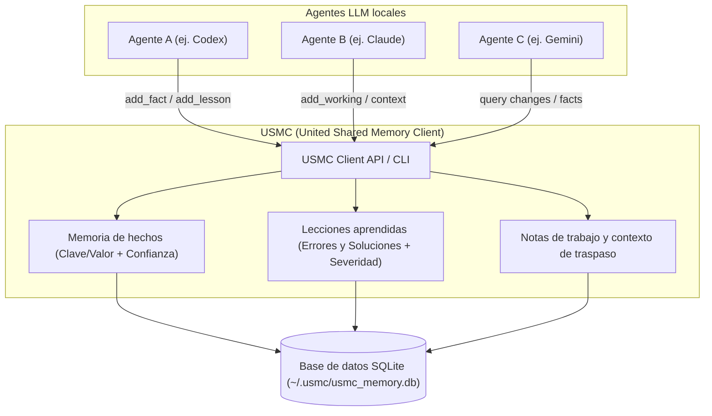
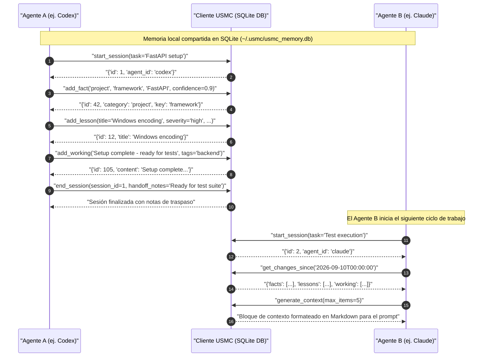

# USMC - United Shared Memory Client

[](https://github.com/ellmos-ai/usmc/actions/workflows/ci.yml)
[](LICENSE)
[](pyproject.toml)
[](tests)
[](llms.txt)

**Idiomas:** [English](README.md) · [Deutsch](README_de.md) · [Español](README_es.md)

[Inicio rápido](#inicio-rápido) • [Arquitectura](#arquitectura-y-flujo-de-datos) • [Secuencia multi-agente](#secuencia-de-interacción-multi-agente) • [Conceptos clave](#conceptos-clave) • [Posicionamiento](#posicionamiento) • [Licencia](#licencia)

USMC es una capa de memoria en Python sin dependencias externas para agentes LLM. Proporciona a múltiples agentes locales una memoria compartida basada en SQLite para hechos, lecciones aprendidas, notas de trabajo, sesiones y contexto compacto para prompts.

Este repositorio corresponde al proyecto de ellmos `ellmos-ai/usmc`, denominado también **ellmos USMC** o **United Shared Memory Client** en textos de búsqueda. No guarda relación con el Cuerpo de Marines de los Estados Unidos (United States Marine Corps).

> [!NOTE]
> **ellmos USMC (United Shared Memory Client)** es la primitiva de memoria compartida de Nivel 1 (Tier 1) para agentes LLM locales en el [ecosistema ellmos AI](https://github.com/ellmos-ai). Ofrece persistencia respaldada por SQLite para hechos, lecciones aprendidas, notas de trabajo y contexto para prompts sin requerir un daemon en segundo plano ni servicios en la nube.

## Comenzar aquí

| Qué | Dónde |
|---|---|
| Instalación | `pip install git+https://github.com/ellmos-ai/usmc.git` |
| Inicio rápido | [Inicio rápido](#inicio-rápido) más abajo |
| Referencia de CLI | `usmc --help` |
| README en inglés | [README.md](README.md) |
| README en alemán | [README_de.md](README_de.md) |
| Pruebas | `python -m pytest -q` |
| Historial de cambios | [CHANGELOG.md](CHANGELOG.md) |
| Incidencias y feedback | [GitHub Issues](https://github.com/ellmos-ai/usmc/issues) |

## Por qué existe

Los proyectos basados en agentes LLM a menudo pierden contexto entre ejecuciones o duplican notas entre múltiples herramientas. USMC mantiene la capa de persistencia compacta y reutilizable:

- Almacenar hechos persistentes con puntuaciones de confianza (`confidence`).
- Registrar lecciones aprendidas como patrones de problema/solución con severidad.
- Mantener notas de trabajo activas asociadas a la sesión actual.
- Registrar sesiones de agentes y notas de traspaso (`handoff`).
- Generar bloques de contexto compactos listos para el prompt de un LLM.
- Compartir una base de datos local SQLite entre diferentes agentes sin daemons.

USMC constituye el Nivel 1 (Tier 1) de la familia ellmos. Proyectos como Rinnsal y BACH construyen capas de orquestación más amplias sobre él, mientras que USMC se enfoca estrictamente en la memoria compartida.

### Arquitectura y flujo de datos



### Secuencia de interacción multi-agente

El siguiente diagrama de secuencia ilustra cómo múltiples agentes autónomos coordinan tareas y transfieren contexto mediante la base de datos local SQLite de USMC sin requerir servicios en segundo plano:



## Instalación

Desde GitHub:

```bash
pip install git+https://github.com/ellmos-ai/usmc.git
```

Desde un clon local:

```bash
pip install -e .
```

Actualmente no hay una versión publicada en PyPI y el nombre `usmc` no está reservado en PyPI (a fecha de 2026-08-08 no existe ningún paquete con ese nombre allí). Hasta la publicación de la primera versión oficial, utilice la instalación directa desde GitHub indicada arriba.

## Inicio rápido

```python
from usmc import USMCClient

client = USMCClient(agent_id="codex")

client.add_fact("project", "framework", "FastAPI", confidence=0.9)
client.add_lesson(
    title="Windows encoding",
    problem="Python subprocess output used cp1252",
    solution="Run with PYTHONIOENCODING=utf-8",
    severity="high",
)
client.add_working("Currently preparing a release checklist")

print(client.generate_context())
```

API de alto nivel:

```python
from usmc import api

api.init(agent_id="claude")
api.remember("repo", "ellmos-ai/usmc")
api.note("Audit README and package metadata")
api.lesson("Marketing check", "No search visibility", "Use ellmos-usmc wording")

print(api.status())
print(api.context())
```

Interfaz de línea de comandos (CLI):

```bash
usmc status
usmc fact project framework FastAPI --confidence 0.9
usmc note "Current task: release polish"
usmc lesson "Encoding bug" "cp1252 output" "Set PYTHONIOENCODING=utf-8" --severity high
usmc context
usmc changes "2026-02-28T00:00:00" --json
```

> [!NOTE]
> **Los nombres de comandos y opciones están en inglés, pero los mensajes del CLI, los textos de `--help` y los encabezados generados por `generate_context()` están actualmente en alemán.** La API de la biblioteca es neutral respecto al idioma; solo la salida en consola está en alemán por el momento.

## Búsqueda y filtros

Cuando múltiples agentes escriben en la misma base de datos, un listado estrictamente cronológico pierde utilidad rápidamente. Por ello, `working`, `facts` y `lessons` admiten filtros integrados:

```bash
usmc working --tags store                  # una etiqueta
usmc working --tags store,release          # coma = OR
usmc working --tags store,release --tags-all   # ... --tags-all convierte en AND
usmc working --agent codex-cli             # filtrar por agente
usmc working --grep "Partner Center"       # subcadena en el contenido

usmc facts   --grep store                  # subcadena en clave o valor
usmc facts   --agent codex-cli
usmc lessons --grep cp1252                 # subcadena en título, problema o solución
usmc lessons --agent codex-cli --severity high
```

Filtros equivalentes en la biblioteca Python:

```python
client.get_working(tags="store,release", tags_all=True, agent_id="codex-cli", grep="wave")
api.working(tags="store")
api.facts(grep="store")
api.lessons(grep="cp1252")
```

Propiedades clave del motor de búsqueda:

- **Los filtros se ejecutan en la consulta SQL, antes del `--limit`**: `--tags store -l 10` devuelve las 10 mejores notas de *store*, no las notas de store entre las 10 más recientes globales.
- **La coincidencia de etiquetas está delimitada**: `--tags rh` no coincide con `research`; la columna se compara con anclajes delimitadores.
- **Los filtros se combinan con AND**: `--tags store --agent codex-cli` requiere ambas condiciones.
- **Ignora mayúsculas/minúsculas en ASCII**: SQLite no realiza plegado Unicode sin ICU; `%` y `_` en el parámetro `--grep` se tratan como caracteres literales, no comodines.

> [!TIP]
> **USMC almacena el estado del proceso, no el estado del dominio.** El estado de un proyecto pertenece a su registro canónico (por ejemplo `releases.json`); USMC registra dónde se detuvo una ejecución y cuál es el siguiente paso. Por convención, **la primera etiqueta de una nota nombra la canalización** (ej. `--tags store`).

## Conceptos clave

| Concepto | Qué almacena | Uso típico |
|---|---|---|
| Hechos (`facts`) | Conocimiento clave/valor persistente con confianza | Datos del proyecto, variables de entorno, preferencias |
| Lecciones (`lessons`) | Registros problema/solución reutilizables con severidad | Errores resueltos, reglas operativas, ajustes de flujo |
| Memoria de trabajo (`working`) | Notas temporales activas | Estado de la tarea actual y notas de borrador |
| Sesiones (`sessions`) | Registros de inicio/fin con notas de traspaso | Continuidad de trabajo entre agentes |
| Cambios (`changes`) | Flujo de actualizaciones consultable | Sincronización ligera entre agentes |

## Ejemplo multi-agente

```python
from usmc import USMCClient

codex = USMCClient(db_path="shared.db", agent_id="codex")
claude = USMCClient(db_path="shared.db", agent_id="claude")

codex.add_fact("project", "status", "needs docs", confidence=0.7)
claude.add_fact("project", "status", "docs ready", confidence=0.95)

print(codex.get_facts(category="project"))
```

La fusión por nivel de confianza se aplica por agente: cuando el mismo agente reescribe un hecho, prevalece el valor con mayor puntuación de confianza. Diferentes agentes mantienen filas independientes para la misma clave; `get_facts()` las devuelve ordenadas por confianza descendente.

## Ubicación predeterminada de la base de datos

Sin una ruta explícita `db_path`, USMC almacena la base de datos de manera local por sistema en `~/.usmc/usmc_memory.db` (creada en el primer uso). Puede anularse mediante la variable de entorno `USMC_DB` o el argumento `--db` / `db_path=`. Esto evita ubicar la base de datos en directorios sincronizados en la nube.

## Esquema de base de datos

- `usmc_facts` - hechos persistentes con puntuaciones de confianza
- `usmc_lessons` - lecciones aprendidas con severidad
- `usmc_working` - notas temporales y contexto de borrador
- `usmc_sessions` - seguimiento de sesiones de agentes
- `usmc_meta` - versión interna del esquema

La base de datos es SQLite estándar puro. No existen daemons, intermediarios de mensajes ni servicios en la nube.

## Posicionamiento

USMC está diseñado para ser deliberadamente más liviano que las plataformas completas de agentes:

| Tipo de proyecto | Alcance | Rol de USMC |
|---|---|---|
| Frameworks de agentes | Herramientas, planificación, orquestación, ejecución | Añade persistencia compartida subyacente |
| Asistentes de chat | Bucle de conversación e interfaz de usuario | Almacena conocimiento duradero fuera del historial de chat |
| Servidores MCP | Exposición de herramientas bajo protocolo | Utiliza USMC como backend de memoria local |
| BACH / Rinnsal | Capas de orquestación de ellmos | USMC actúa como la primitiva de memoria reutilizable |

## Desarrollo

```bash
python -m pytest -q
python -m compileall -q usmc tests
python -m build
```

## Proyectos relacionados

- [Rinnsal](https://github.com/ellmos-ai/rinnsal) - capa compacta de orquestación de ellmos
- [BACH](https://github.com/ellmos-ai/bach) - sistema operativo basado en texto para LLMs
- [ellmos-stack](https://github.com/ellmos-ai/ellmos-stack) - contexto de despliegue y ecosistema

## Licencia

Licencia MIT - Copyright (c) 2026 Lukas Geiger

## Responsabilidad

Este proyecto constituye una donación de software de código abierto sin remuneración. La responsabilidad queda limitada al dolo y la negligencia grave conforme al artículo 521 del Código Civil Alemán (BGB). Su uso es bajo la propia responsabilidad del usuario. No se otorga ninguna garantía ni compromiso de mantenimiento o idoneidad para un propósito particular.
