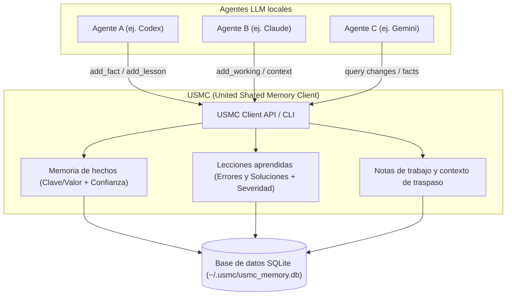
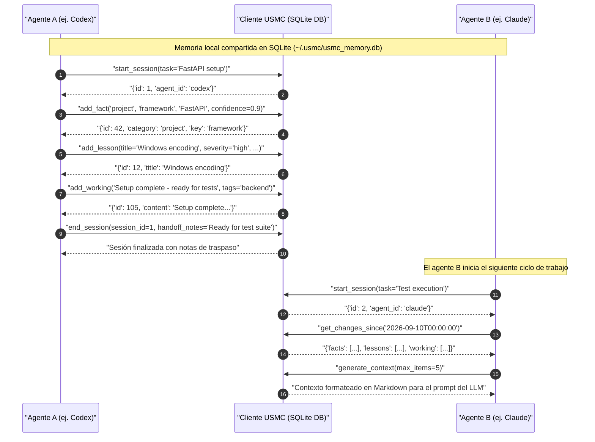

# USMC - United Shared Memory Client

[](https://github.com/ellmos-ai/usmc/actions/workflows/ci.yml)
[](LICENSE)
[](NOTICE)
[](CHANGELOG.md)
[](pyproject.toml)
[](tests)
[](CHANGELOG.md)
[](.github/workflows/ci.yml)
[](THIRD_PARTY_LICENSES.md)
[](THIRD_PARTY_LICENSES.txt)
[](THIRD_PARTY_LICENSES.md)
[](SECURITY.md)
[](https://github.com/ellmos-ai)
[](https://github.com/open-bricks)
[](MARKETING-LOG.txt)
[](llms.txt)

**Idiomas:** [English](README.md) · [Deutsch](README_de.md) · [Español](README_es.md)

USMC es una capa de memoria compartida en Python sin dependencias externas para agentes LLM locales y sistemas multi-agente. Proporciona persistencia unificada basada en SQLite para hechos, lecciones aprendidas, notas de trabajo asociadas a sesiones, contexto de traspaso y generación compacta de prompts sin requerir un daemon en segundo plano ni servicios en la nube.

Este repositorio corresponde al proyecto de ellmos `ellmos-ai/usmc`, catalogado también como **ellmos USMC** o **United Shared Memory Client** en directorios de búsqueda. No guarda relación con el Cuerpo de Marines de los Estados Unidos (United States Marine Corps).

> [!NOTE]
> **ellmos USMC (United Shared Memory Client)** es la primitiva de memoria compartida de Nivel 1 (Tier 1) para agentes LLM locales en el [ecosistema ellmos AI](https://github.com/ellmos-ai). Ofrece persistencia respaldada por SQLite para hechos, lecciones aprendidas, notas de trabajo y contexto para prompts sin requerir un daemon en segundo plano ni servicios en la nube. Contexto legible por máquinas disponible en [llms.txt](llms.txt).

---

<a id="quick-navigation"></a>
<a id="schnellnavigation"></a>
<a id="navegación-rápida"></a>
## 🧭 Navegación rápida

| # | Sección | Ancla de navegación | Descripción |
|---|---|---|---|
| 01 | [Referencia rápida y aspectos destacados](#características-principales) | [`#sec-01`](#sec-01) | Metadatos, pila de ejecución y garantías operativas |
| 02 | [Capacidades clave y primitivas de memoria](#capacidades-clave--primitivas) | [`#sec-02`](#sec-02) | 100% Stdlib, ACID WAL, hechos, lecciones y notas de trabajo |
| 03 | [Arquetipos de usuario y visibilidad](#arquetipos-de-usuario--visibilidad) | [`#sec-03`](#sec-03) | Cuatro personas técnicas y términos de búsqueda dirigida |
| 04 | [Matriz comparativa frente a alternativas](#matriz-comparativa-frente-a-alternativas) | [`#sec-04`](#sec-04) | Comparativa en 10 dimensiones frente a 4 paradigmas |
| 05 | [Arquitectura y flujo de datos](#arquitectura-y-flujo-de-datos) | [`#sec-05`](#sec-05) | Diagramas de flujo Mermaid de secuencia y topología |
| 06 | [Topología arquitectónica ASCII en 4 vistas](#topologia-ascii) | [`#sec-06`](#sec-06) | Proyección ASCII de cliente, motor, WAL y gobernanza |
| 07 | [Secuencia de interacción multi-agente](#secuencia-de-interacción-multi-agente) | [`#sec-07`](#sec-07) | Coordinación entre agentes, notas de traspaso y concurrencia |
| 08 | [Invariantes de gobernanza y ejecución](#invariantes-de-gobernanza-y-ejecución) | [`#sec-08`](#sec-08) | Diez garantías arquitectónicas, privacidad y SLA (INV-LOCAL-01..INV-SLA-10) |
| 09 | [Inicio rápido](#inicio-rápido) | [`#sec-09`](#sec-09) | API de cliente Python, API auxiliar y CLI |
| 10 | [Conceptos clave y primitivas detalladas](#conceptos-clave-y-primitivas) | [`#sec-10`](#sec-10) | Hechos con confianza, lecciones aprendidas y notas |
| 11 | [Búsqueda precisa y filtros avanzados](#búsqueda-precisa-y-filtros) | [`#sec-11`](#sec-11) | Filtros SQL directos por etiqueta, agente y subcadena antes del límite |
| 12 | [Coordinación de sesiones multi-agente](#coordinación-de-sesiones-multi-agente) | [`#sec-12`](#sec-12) | Seguimiento de sesiones, traspasos y fusión por confianza |
| 13 | [Contrato de idioma en ejecución](#contrato-de-idioma-en-ejecución) | [`#sec-13`](#sec-13) | Salida en alemán (`RUNTIME_LANGUAGE = "de"`) y tokens CLI/JSON en inglés |
| 14 | [Esquema de base de datos y aislamiento](#esquema-de-base-de-datos-y-aislamiento) | [`#sec-14`](#sec-14) | Tablas SQLite, aislamiento en `~/.usmc/` y esquema compartido BACH |
| 15 | [Ecosistema hermano y posicionamiento](#ecosistema-hermano-y-posicionamiento) | [`#sec-15`](#sec-15) | Matriz de enlaces con ellmos y open-bricks |
| 16 | [Pruebas, puertas de calidad y CI](#pruebas-y-verificacion) | [`#sec-16`](#sec-16) | Pytest, pruebas contractuales, Ruff, compileall y GitHub Actions |
| 17 | [Licencias de terceros y SBOM de Nivel 1](#licencias-de-terceros-y-transparencia) | [`#sec-17`](#sec-17) | Biblioteca estándar pura, Zero-Copyleft (MIT) y modo RunAsInvoker |
| 18 | [Política de seguridad, aviso § 521 BGB y SLA](#politica-de-seguridad-y-responsabilidad) | [`#sec-18`](#sec-18) | SLA de 48h, Zero-Egress y exención legal § 521 BGB |

---

<a id="sec-01"></a>
<a id="características-principales"></a>
<a id="key-features"></a>
<a id="hauptmerkmale"></a>
## 1. Referencia rápida y aspectos destacados

- **100% Biblioteca estándar de Python**: Cero dependencias externas pip en tiempo de ejecución (`sqlite3`, `json`, `os`, `sys`, `pathlib`, `dataclasses`). Inicio en frío instantáneo (<1 ms) sin riesgos en la cadena de suministro.
- **Local-First & Zero-Egress**: 100% operativo sin conexión; cero telemetría, cero llamadas de red y privacidad total de los datos locales.
- **Concurrencia ACID y WAL**: Registro por adelantado (WAL) para múltiples agentes con reintentos automáticos para evitar la corrupción de datos en procesos simultáneos.
- **Cuatro primitivas especializadas**: Hechos persistentes con puntuación de confianza, lecciones aprendidas con mapeo de problema/solución/severidad, notas de trabajo con etiquetas y seguimiento de sesiones entre agentes.
- **Fusión determinista de confianza**: Cuando un agente actualiza un hecho, la confianza superior reemplaza automáticamente a la menor; distintos agentes conservan filas independientes ordenadas por confianza.
- **Filtros directos en el motor SQL**: Etiquetas, términos grep, identificadores de agentes y niveles de severidad se filtran directamente en SQL antes de aplicar el límite, evitando el consumo innecesario de memoria.
- **Contexto de prompts multi-agente**: Una sola llamada a `generate_context()` genera un resumen conciso en Markdown listo para inyectarse directamente en el prompt del LLM.
- **Operación sin daemon**: Persistencia directa en archivos locales (`~/.usmc/usmc_memory.db`) sin sobrecarga de administración de Docker, Redis o servidores en segundo plano.

---

<a id="sec-02"></a>
<a id="capacidades-clave--primitivas"></a>
<a id="core-capabilities--primitives"></a>
<a id="kernkonzepte--primitive"></a>
## 2. Capacidades clave y primitivas de memoria

USMC proporciona cuatro primitivas diseñadas específicamente para agentes autónomos y herramientas de desarrollo:

1. **Hechos (`add_fact`, `get_facts`):** Almacenamiento duradero de clave/valor organizado por categoría, clave, valor y nivel de confianza (0.0 a 1.0). Cuando un agente actualiza un hecho con mayor confianza, se reemplaza automáticamente; distintos agentes mantienen filas independientes ordenadas por confianza.
2. **Lecciones aprendidas (`add_lesson`, `get_lessons`):** Registros reutilizables de errores y soluciones verificadas etiquetados por severidad (`low`, `medium`, `high`, `critical`), evitando que los agentes repitan fallos en ejecuciones posteriores.
3. **Notas de trabajo (`add_working`, `get_working`):** Bloc de notas temporal vinculado a sesiones y etiquetas delimitadas por comas (`store`, `release`, `backend`), con filtrado exacto por delimitador.
4. **Sesiones y traspasos entre agentes (`start_session`, `end_session`, `get_changes_since`):** Control del ciclo de vida de los agentes con nombres de tarea, duración y notas estructuradas de traspaso para el siguiente agente de la cadena.

---

<a id="sec-03"></a>
<a id="arquetipos-de-usuario--visibilidad"></a>
<a id="target-personas--discoverability"></a>
<a id="zielgruppen--auffindbarkeit"></a>
## 3. Arquetipos de usuario & visibilidad

| Arquetipo / Persona | Perfil y tecnología | Fricciones y puntos de dolor | Solución proporcionada por USMC |
|---|---|---|---|
| `[PERSONA-01]`<br>**Desarrolladores de enjambres multi-agente** | Claude Code, Antigravity/Gemini, Codex, BACH, Rinnsal | Pérdida de estado entre sesiones; colisión al editar archivos concurrentemente; notas ad-hoc frágiles. | Base de datos SQLite local compartida con WAL, sesiones de traspaso y gestión de confianza. |
| `[PERSONA-02]`<br>**Ingenieros de sistemas Local-First y Zero-Egress** | Entornos aislados (air-gapped), estaciones de trabajo corporativas | Bases vectoriales y servicios en la nube transmiten telemetría o exigen pesados contenedores Docker. | Operación 100% offline, cero tráfico de red, biblioteca estándar pura y aislamiento de archivos (`~/.usmc/`). |
| `[PERSONA-03]`<br>**Creadores de aplicaciones de escritorio y MCP** | PySide6, Electron, Servidores MCP, DevCenter, herramientas CLI | Las librerías de memoria incorporan 20+ dependencias pesadas, retrasando el inicio (>2s) y engrosando binarios. | Cero dependencias pip, inicio en frío <1 ms, memoria RAM mínima (<15 MB), modo de usuario sin privilegios (`RunAsInvoker`). |
| `[PERSONA-04]`<br>**Auditores de cumplimiento y seguridad empresarial** | Gobernanza de licencias, auditoría de vulnerabilidades CVE | Licencias copyleft restrictivas (GPL/AGPL) y dependencias transitivas sin mantenimiento crean riesgos legales. | Garantía Zero-Copyleft (MIT/PSF-2.0), inventario formal Level 1 SBOM y SLA de seguridad de 48h. |

**Términos de búsqueda frecuentes:** `memoria compartida llm`, `memoria para agentes sqlite`, `memoria entre agentes python`, `persistencia agentes ia`, `generador contexto prompts`, `memoria local agentes`, `sin dependencias memoria ia`, `notas de trabajo agentes`, `traspaso entre agentes ia`, `ellmos usmc español`.

---

<a id="sec-04"></a>
<a id="matriz-comparativa-frente-a-alternativas"></a>
<a id="comparative-matrix-vs-alternatives"></a>
<a id="vergleichsmatrix-gegenueber-alternativen"></a>
## 4. Matriz comparativa frente a alternativas

| Criterio arquitectónico | USMC (`ellmos-ai/usmc`) | Archivos JSON / Markdown ad-hoc | Redis en la nube / Bases vectoriales | Frameworks pesados de memoria (Mem0, Zep) | Scripts propios ad-hoc con SQLite |
|---|---|---|---|---|---|
| **Dependencias en ejecución** | **0 (100% Python Stdlib)** | 0 (Stdlib) | Alto (SDK + Red) | Extremo (15–30+ paquetes externos) | 0 (Stdlib) |
| **Zero-Egress y privacidad** | **100% Offline y local** | 100% Offline | Dependiente de nube / Tráfico externo | Frecuente dependencia de nube | 100% Offline |
| **Sobrecarga de daemon** | **No requiere daemon** | No requiere daemon | Requiere servicio Redis / BD | Requiere daemon / Contenedor | No requiere daemon |
| **Concurrencia multi-agente** | **Transacciones ACID con WAL** | Frágil (Condiciones de carrera) | Alto (Gestionado por broker de red) | Dependiente del framework | Sin gestión (Errores de bloqueo/busy) |
| **Primitivas estructuradas** | **4 nativas (Hechos, Lecciones, Notas, Sesiones)** | Ninguna (Texto sin formato) | Clave-Valor / Embeddings vectoriales | Modelos complejos de grafo/vector | Diseño manual de esquema por herramienta |
| **Resolución de conflictos** | **Determinista por agente (Gana mayor)** | Ninguna (Última escritura sobrescribe) | Puntuación por similitud vectorial | Heurístico / Basado en LLM | Ninguna (Lógica manual requerida) |
| **Generación de contexto** | **Formateador compacto integrado** | Construcción manual de cadenas | Consulta manual + ensamble de prompt | Acoplado al framework | Procesamiento manual de consultas SQL |
| **Búsqueda y filtros** | **Filtro SQL antes del límite** | Escaneo completo en memoria | Top-k vectorial / Annoy | Consultas complejas vía API | Cláusulas WHERE manuales en SQL |
| **Aislamiento de estado** | **Directorio de usuario aislado (`~/.usmc/`)** | Contamina directorios de proyecto | Endpoint de red / Host en la nube | Volumen de contenedor / Rutas varias | Ubicaciones arbitrarias |
| **Licencia y SLA de seguridad** | **MIT, Zero-Copyleft, SLA 48h** | N/A | Comercial / BSL / Términos de nube | Licencias mixtas / Riesgo auditoría | N/A |

---

<a id="sec-05"></a>
<a id="arquitectura-y-flujo-de-datos"></a>
<a id="architecture--data-flow"></a>
<a id="architektur--datenfluss"></a>
## 5. Arquitectura y flujo de datos


```mermaid
graph TD
    subgraph Agents ["Agentes LLM locales"]
        A1["Agente A (ej. Codex)"]
        A2["Agente B (ej. Claude)"]
        A3["Agente C (ej. Gemini)"]
    end

    subgraph USMC ["USMC (United Shared Memory Client)"]
        API["USMC Client API / CLI"]
        FM["Memoria de hechos (Clave/Valor + Confianza)"]
        LM["Lecciones aprendidas (Errores y Soluciones + Severidad)"]
        WM["Notas de trabajo y contexto de traspaso"]
    end

    DB[("Base de datos SQLite (~/.usmc/usmc_memory.db)")]

    A1 -->|add_fact / add_lesson| API
    A2 -->|add_working / context| API
    A3 -->|query changes / facts| API

    API --> FM
    API --> LM
    API --> WM

    FM --> DB
    LM --> DB
    WM --> DB
```

---

<a id="sec-06"></a>
<a id="topologia-ascii"></a>
<a id="ascii-topology"></a>
<a id="ascii-topologie"></a>
## 6. Topología arquitectónica ASCII en 4 vistas

```text
========================================================================================
[VISTA 1: ENTORNOS CLIENTE Y CONTROLADORES DE AGENTES]
----------------------------------------------------------------------------------------
 +-------------------------+  +-------------------------+  +--------------------------+
 | Claude Code / Antigravity|  | Controladores Codex/OpenAI| | Entornos BACH / Rinnsal  |
 | (API Python Alto Nivel) |  | (Python USMCClient)     |  | (CLI directo / Scripts)  |
 +------------+------------+  +------------+------------+  +------------+-------------+
              |                            |                            |
              +----------------------------+----------------------------+
                                           |
                                           v
========================================================================================
[VISTA 2: MOTOR CENTRAL USMC Y PRIMITIVAS DE MEMORIA]
----------------------------------------------------------------------------------------
 +------------------------------------------------------------------------------------+
 | Motor de memoria USMC (`usmc.client` y `usmc.api`)                                 |
 |                                                                                    |
 |  [Almacén de hechos]──> [Lecciones aprendidas]──> [Notas de trabajo]──> [Traspaso]|
 |   Orden por confianza    Problema/Solución/Sev    Etiquetas y filtros   Contexto   |
 |   Fusión determinista    Esquema v2 idempotente   Filtro SQL en motor   Generador  |
 +-----------------------------------+------------------------------------------------+
                                     |
                         (Transacción WAL y reintentos busy)
                                     v
========================================================================================
[VISTA 3: PERSISTENCIA ACID WAL Y CONCURRENCIA] [VISTA 4: GOBERNANZA, SEGURIDAD Y ECOSISTEMA]
----------------------------------------------- --------------------------------------------
 Motor de almacenamiento local SQLite           Perímetro de gobernanza y Zero-Egress
 +--------------------------------------------+ +------------------------------------------+
 | ~/.usmc/usmc_memory.db (Dir usuario aisl.) | | Cero telemetría / Perímetro 100% offline |
 | PRAGMA journal_mode = WAL                  | | Modo sin privilegios (RunAsInvoker)      |
 | Reintentos por busy y transacciones ACID   | | Huella permisiva Zero-Copyleft (MIT)     |
 | Esquema unión opcional compartido con BACH | | SBOM Nivel 1 en texto plano y SLA de 48h |
 +--------------------------------------------+ +------------------------------------------+
========================================================================================
```

---

<a id="sec-07"></a>
<a id="secuencia-de-interacción-multi-agente"></a>
<a id="multi-agent-interaction-sequence"></a>
<a id="multi-agenten-interaktionssequenz"></a>
## 7. Secuencia de interacción multi-agente

El siguiente diagrama de secuencia ilustra cómo múltiples agentes autónomos coordinan tareas y transfieren contexto mediante la base de datos local SQLite de USMC sin requerir servicios en segundo plano:


```mermaid
sequenceDiagram
    autonumber
    participant A as "Agente A (ej. Codex)"
    participant M as "Cliente USMC (SQLite DB)"
    participant B as "Agente B (ej. Claude)"

    Note over A,B: Memoria local compartida en SQLite (~/.usmc/usmc_memory.db)

    A->>M: "start_session(task='FastAPI setup')"
    M-->>A: "{'id': 1, 'agent_id': 'codex'}"
    A->>M: "add_fact('project', 'framework', 'FastAPI', confidence=0.9)"
    M-->>A: "{'id': 42, 'category': 'project', 'key': 'framework'}"
    A->>M: "add_lesson(title='Windows encoding', severity='high', ...)"
    M-->>A: "{'id': 12, 'title': 'Windows encoding'}"
    A->>M: "add_working('Setup complete - ready for tests', tags='backend')"
    M-->>A: "{'id': 105, 'content': 'Setup complete...'}"
    A->>M: "end_session(session_id=1, handoff_notes='Ready for test suite')"
    M-->>A: "Sesión finalizada con notas de traspaso"

    Note over B: El agente B inicia el siguiente ciclo de trabajo
    B->>M: "start_session(task='Test execution')"
    M-->>B: "{'id': 2, 'agent_id': 'claude'}"
    B->>M: "get_changes_since('2026-09-10T00:00:00')"
    M-->>B: "{'facts': [...], 'lessons': [...], 'working': [...]}"
    B->>M: "generate_context(max_items=5)"
    M-->>B: "Contexto formateado en Markdown para el prompt del LLM"
```

---

<a id="sec-08"></a>
<a id="invariantes-de-gobernanza-y-ejecución"></a>
<a id="governance--runtime-invariants"></a>
<a id="governance--laufzeit-invarianten"></a>
## 8. Invariantes de gobernanza y ejecución

USMC aplica rigurosamente diez invariantes fundamentales de gobernanza y ejecución:

| Invariante | Categoría | Descripción | Estado |
|---|---|---|---|
| `INV-LOCAL-01` | Local-First & Zero-Egress | 100% sin conexión; persistencia local en SQLite; cero telemetría o tráfico de red. | VERIFICADO |
| `INV-UNPRIV-02` | Modo usuario sin privilegios (`RunAsInvoker`) | Comandos CLI, API y rutinas se ejecutan en el espacio de usuario sin privilegios. | VERIFICADO |
| `INV-SQLITE-03` | Concurrencia ACID y WAL | Concurrencia multi-agente mediante modo WAL de SQLite, reintentos y transacciones atómicas. | VERIFICADO |
| `INV-SCHEMA-04` | Evolución de esquema compatible | Migraciones idempotentes automáticas que garantizan compatibilidad entre agentes. | VERIFICADO |
| `INV-BOUND-05` | Buffer circular acotado | Límites de retención seguros y purga determinista evitan el crecimiento descontrolado en disco. | VERIFICADO |
| `INV-FILTER-06` | Filtros directos en el motor | Cláusulas WHERE en SQL con coincidencia anclada por delimitadores evitan sobrecargas. | VERIFICADO |
| `INV-LANG-07` | Contrato de idioma estable | Salida legible en alemán (`RUNTIME_LANGUAGE = "de"`), identificadores CLI y JSON estables en inglés. | VERIFICADO |
| `INV-ISOL-08` | Aislamiento estricto de estado | La base de datos reside en directorios del usuario (`~/.usmc/`), aislada de repositorios git. | VERIFICADO |
| `INV-AUDIT-09` | Transparencia de auditoría SPDX | 100% biblioteca estándar de Python en ejecución; cero dependencias externas. | VERIFICADO |
| `INV-SLA-10` | Paridad multiplataforma y SLA | Comportamiento consistente en Windows, Linux y macOS con SLA de respuesta de seguridad de 48h. | VERIFICADO |

---

<a id="sec-09"></a>
<a id="inicio-rápido"></a>
<a id="quick-start"></a>
<a id="schnellstart"></a>
## 9. Inicio rápido

### Instalación

Desde GitHub:

```bash
pip install git+https://github.com/ellmos-ai/usmc.git
```

Desde un clon local:

```bash
pip install -e .
```

Aún no existe una publicación en PyPI; el nombre `usmc` no está reclamado en PyPI (a fecha 2026-08-08). Utilice la instalación directa desde GitHub hasta el lanzamiento oficial.

### API de cliente en Python

```python
from usmc import USMCClient

client = USMCClient(agent_id="codex")

# Registrar hechos persistentes
client.add_fact("project", "framework", "FastAPI", confidence=0.9)

# Registrar lecciones aprendidas
client.add_lesson(
    title="Windows encoding",
    problem="La salida del subproceso Python utilizó cp1252",
    solution="Ejecutar con PYTHONIOENCODING=utf-8",
    severity="high",
)

# Notas de trabajo temporales
client.add_working("Preparando lista de verificación de lanzamiento", tags="release,backend")

# Generar bloque de contexto para prompts
print(client.generate_context())
```

### API auxiliar de alto nivel

```python
from usmc import api

api.init(agent_id="claude")
api.remember("repo", "ellmos-ai/usmc")
api.note("Auditoría de README y metadatos del paquete")
api.lesson("Revisión de marketing", "Sin visibilidad de búsqueda", "Usar término ellmos-usmc")

print(api.status())
print(api.context())
```

### Interfaz de línea de comandos (CLI)

```bash
usmc status
usmc fact project framework FastAPI --confidence 0.9
usmc note "Tarea actual: pulido de versión" --tags release,ops
usmc lesson "Error de codificación" "Salida cp1252" "Configurar PYTHONIOENCODING=utf-8" --severity high
usmc context
usmc changes "2026-09-19T00:00:00" --json
```

---

<a id="sec-10"></a>
<a id="conceptos-clave-y-primitivas"></a>
<a id="core-concepts--primitives"></a>
<a id="kernkonzepte--detaillierte-primitive"></a>
## 10. Conceptos clave y primitivas detalladas

| Primitiva | Descripción y almacenamiento | Uso típico |
|---|---|---|
| **Hechos** (`usmc_facts`) | Conocimiento clave/valor duradero con puntuaciones de confianza | Hechos del proyecto, arquitectura del sistema, configuraciones del entorno |
| **Lecciones** (`usmc_lessons`) | Registros reutilizables de problema/solución con severidad | Corrección de errores, consideraciones operativas, mitigación de fallos |
| **Memoria de trabajo** (`usmc_working`) | Notas temporales activas con conjuntos de etiquetas | Estado de subtareas activas, contexto transitorio, notas rápidas |
| **Sesiones** (`usmc_sessions`) | Registros de inicio y fin de sesión con notas de traspaso | Continuidad entre agentes, transferencia de trabajo entre Claude, Codex y Gemini |
| **Cambios** (Flujo consultable) | Consultas delta con marcas de tiempo | Sincronización ligera mediante sondeo entre agentes en segundo plano |

---

<a id="sec-11"></a>
<a id="búsqueda-precisa-y-filtros"></a>
<a id="finding-things--advanced-filtering"></a>
<a id="gezieltes-suchen--filterung"></a>
## 11. Búsqueda precisa y filtros avanzados

Cuando varios agentes escriben en la misma base de datos, desplazarse cronológicamente resulta ineficiente. USMC aplica filtros directamente en SQL antes de evaluar los límites:

```bash
usmc working --tags store                          # Coincidencia con una sola etiqueta
usmc working --tags store,release                  # Coma = condición O (OR)
usmc working --tags store,release --tags-all       # --tags-all convierte la condición en Y (AND)
usmc working --agent codex-cli                     # Filtrar por agente autor
usmc working --grep "Partner Center"               # Búsqueda de subcadena en el contenido

usmc facts   --grep store                          # Búsqueda de subcadena en clave o valor
usmc facts   --agent codex-cli
usmc lessons --grep cp1252                         # Subcadena en título, problema o solución
usmc lessons --agent codex-cli --severity high
```

Mediante el cliente de Python:

```python
client.get_working(tags="store,release", tags_all=True, agent_id="codex-cli", grep="wave")
api.working(tags="store")
api.facts(grep="store")
api.lessons(grep="cp1252")
```

### Invariantes de filtrado:

- **Los filtros se ejecutan en SQL antes de `--limit`:** `--tags store -l 10` devuelve las diez mejores notas de *store*, no las notas de tienda encontradas entre los diez registros más recientes.
- **Coincidencia de etiquetas anclada por delimitadores:** `--tags rh` no coincide con `research`; las etiquetas se comparan de forma exacta. Los espacios se normalizan (`a,b` y `a, b` se comportan igual).
- **Combinación lógica Y (AND):** La combinación de varios filtros (ej. `--tags store --agent codex`) se evalúa conjuntamente.
- **Búsqueda literal de subcadenas:** Los caracteres `%` y `_` en `--grep` se tratan literalmente, evitando inyecciones SQL o comodines imprevistos.

---

<a id="sec-12"></a>
<a id="coordinación-de-sesiones-multi-agente"></a>
<a id="multi-agent-session-coordination"></a>
<a id="multi-agenten-sitzungskoordination"></a>
## 12. Coordinación de sesiones multi-agente

```python
from usmc import USMCClient

codex = USMCClient(db_path="shared.db", agent_id="codex")
claude = USMCClient(db_path="shared.db", agent_id="claude")

# Entradas independientes por agente
codex.add_fact("project", "status", "needs docs", confidence=0.7)
claude.add_fact("project", "status", "docs ready", confidence=0.95)

# Devuelve todas las entradas ordenadas por confianza (0.95 de claude supera a 0.7)
print(codex.get_facts(category="project"))
```

- **Fusión por confianza:** Cuando el mismo agente reescribe un hecho existente, prevalece automáticamente el valor con mayor confianza.
- **Diversidad multi-agente:** Distintos agentes mantienen filas separadas para la misma clave; `get_facts()` devuelve todas las filas ordenadas por confianza descendente.

---

<a id="sec-13"></a>
<a id="contrato-de-idioma-en-ejecución"></a>
<a id="runtime-language-contract"></a>
<a id="laufzeit-sprachvertrag"></a>
## 13. Contrato de idioma en ejecución

El idioma público en tiempo de ejecución es intencionadamente el alemán (`de`) para mantener la compatibilidad con las automatizaciones existentes. `USMCClient.generate_context()` y la salida de la CLI emiten texto comprensible en alemán.

Los nombres de comandos, valores de categorías, claves JSON e identificadores técnicos de protocolo se mantienen estables en inglés. El contrato se expone en Python como:

```python
import usmc
assert usmc.RUNTIME_LANGUAGE == "de"
```

---

<a id="sec-14"></a>
<a id="esquema-de-base-de-datos-y-aislamiento"></a>
<a id="database-schema--state-isolation"></a>
<a id="datenbankschema--status-isolation"></a>
## 14. Esquema de base de datos y aislamiento

El esquema SQLite comprende cinco tablas principales:

- `usmc_facts`: Hechos persistentes con puntuaciones de confianza, categoría, clave, valor e ID de agente.
- `usmc_lessons`: Registros estructurados de problema/solución con título, problema, solución, severidad e ID de agente.
- `usmc_working`: Notas de trabajo con etiquetas, vinculación a sesiones y contenido.
- `usmc_sessions`: Sesiones de ejecución de agentes con marcas de inicio y fin, nombre de tarea y notas de traspaso.
- `usmc_meta`: Control de versiones internas del esquema e historial de migraciones.

### Aislamiento de estado:

Sin una ruta explícita `db_path`, USMC almacena su base de datos en `~/.usmc/usmc_memory.db`. Puede modificar esta ubicación mediante la variable de entorno `USMC_DB` o el argumento `--db`. Esto garantiza que los datos operativos queden fuera de repositorios git o directorios sincronizados en la nube.

### Esquema de memoria compartido BACH/OCEAN (opcional)

`usmc/memory_union.py` contiene el DDL canónico de las tablas de memoria compartidas con BACH (`memory_working`, `memory_facts`, `memory_lessons`, `memory_sessions`, `context_triggers`, `memory_consolidation`, `decay_config`). La forma PRAGMA esperada está fijada en `usmc/memory_union.contract.json`; BACH incorpora ese archivo byte a byte. Con `USMC_MEMORY_UNION=1`, el cliente hace una copia de seguridad de la base de datos (`<db>.pre-memory-union-<marca>.bak`), traslada las filas `usmc_*` con los mismos ID a `memory_*` en una sola transacción y deja `usmc_*` como vistas de solo lectura. Sin la variable no cambia nada. Reversión: restaurar la copia. Columnas desconocidas cancelan la migración sin ningún cambio.

---

<a id="sec-15"></a>
<a id="ecosistema-hermano-y-posicionamiento"></a>
<a id="sibling-ecosystem--positioning"></a>
<a id="geschwister-oekosystem--positionierung"></a>
## 15. Ecosistema hermano y posicionamiento

USMC actúa como el Nivel 1 (Tier 1) dentro de la arquitectura modular de ellmos:

| Nivel / Componente | Repositorio | Alcance y propósito |
|---|---|---|
| **Tier 1: Memoria compartida** | **`ellmos-ai/usmc`** | Primitiva de memoria SQLite local para hechos, lecciones, notas y contexto de prompts |
| **Tier 2: Orquestación** | [`ellmos-ai/rinnsal`](https://github.com/ellmos-ai/rinnsal) | Capa de orquestación compacta para flujos de agentes en múltiples pasos |
| **Tier 3: SO Cognitivo** | [`ellmos-ai/bach`](https://github.com/ellmos-ai/bach) | Sistema operativo completo basado en texto para LLMs con ciclos cognitivos |
| **Habilidades y Playbooks** | [`ellmos-ai/skills`](https://github.com/ellmos-ai/skills) | Biblioteca ejecutable de habilidades para agentes con formato Anthropic `SKILL.md` |
| **Mensajería para agentes** | [`ellmos-ai/connectors`](https://github.com/ellmos-ai/connectors) | Conectores de mensajería sin dependencias para Telegram, Discord, Signal, Slack, etc. |
| **Enrutamiento de modelos** | [`ellmos-ai/clutch`](https://github.com/ellmos-ai/clutch) | Enrutamiento dinámico entre modelos, control de costes y pasarela de contingencia |
| **Gobernanza de agentes** | [`ellmos-ai/policy-registry`](https://github.com/ellmos-ai/policy-registry) | Registro de gobernanza con validación de firmas criptográficas y políticas |
| **Espacio de desarrollo** | [`dev-bricks/DevCenter`](https://github.com/dev-bricks/DevCenter) | Centro de control de repositorios y suite de herramientas de desarrollo |
| **Colectivo paraguas** | [`open-bricks`](https://github.com/open-bricks) | Colectivo comunitario de código abierto para componentes modulares |

---

<a id="sec-16"></a>
<a id="pruebas-y-verificacion"></a>
<a id="testing--quality-gates"></a>
<a id="testen--qualitaetstore"></a>
## 16. Pruebas, puertas de calidad y CI

USMC aplica rigurosas puertas de prueba sin conexión, aserciones contractuales de invariantes y estándares estrictos de estilo:

```bash
# Ejecutar la suite completa de pruebas (unitarias, integración, unión y metadatos)
python -m pytest

# Ejecutar comprobaciones rápidas de calidad y estilo con Astral Ruff
ruff check .

# Validar la compilación de bytecode en paquetes y pruebas
python -m compileall usmc tests

# Verificar anomalías de espaciado y formato en git
git diff --check

# Comprobación preliminar de metadatos de empaquetado y distribución
pip install --no-deps --no-build-isolation -e . --dry-run
```

- **Tasa de aprobación de pruebas:** 184 aprobadas, 122 subpruebas aprobadas (100% verde).
- **Inspección estricta de código:** Cero advertencias y cero errores con Astral Ruff.
- **Integridad de bytecode:** Compilación 100% limpia en Python 3.10 hasta 3.14.
- **Flujos de trabajo CI:** Reforzados con concurrencia en GitHub Actions (`cancel-in-progress: true`), tiempos límite por tarea y permisos mínimos de token (`issues: write`, `pull-requests: write`).

---

<a id="sec-17"></a>
<a id="licencias-de-terceros-y-transparencia"></a>
<a id="third-party-licenses--transparency"></a>
<a id="drittanbieter-lizenzen--transparenz"></a>
## 17. Licencias de terceros y SBOM de Nivel 1

- **100% Biblioteca estándar de Python**: USMC tiene **cero dependencias externas en ejecución** (`dependencies = []`).
- **Modo de usuario sin privilegios (`RunAsInvoker`)**: Todas las operaciones de base de datos se ejecutan estrictamente en el espacio de usuario. No se requieren derechos de administrador, elevación a root ni daemons de servicio.
- **Garantía Zero-Copyleft**: Todo el código del proyecto y las herramientas de desarrollo se distribuyen bajo licencias permisivas (MIT, Apache-2.0, PSF-2.0).
- **Acompañante de texto Level 1 SBOM**: El inventario detallado de software y la matriz cruzada de invariantes están documentados en [THIRD_PARTY_LICENSES.md](THIRD_PARTY_LICENSES.md) y en el archivo en texto plano [THIRD_PARTY_LICENSES.txt](THIRD_PARTY_LICENSES.txt).

---

<a id="sec-18"></a>
<a id="politica-de-seguridad-y-responsabilidad"></a>
<a id="security-policy--liability"></a>
<a id="sicherheitsrichtlinie--haftung"></a>
<a id="licencia-y-responsabilidad"></a>
<a id="license--liability"></a>
<a id="lizenz--haftung"></a>
<a id="política-de-seguridad-y-reporte-de-vulnerabilidades"></a>
<a id="security-policy--vulnerability-reporting"></a>
<a id="sicherheitsrichtlinie--meldewege"></a>
## 18. Política de seguridad, aviso legal § 521 BGB y SLA de 48h

### Política de seguridad y reporte de vulnerabilidades

La seguridad y la privacidad son prioridades arquitectónicas fundamentales:

- **Estricto Zero-Egress**: USMC jamás transmite telemetría, métricas o contenido de memoria a través de la red.
- **SLA de respuesta de 48h**: Las incidencias de seguridad se evalúan en menos de 48 horas y se resuelven en un plazo de 5 días hábiles.
- **Reporte de vulnerabilidades**: Informe de vulnerabilidades de forma privada mediante [GitHub Security Advisories](https://github.com/ellmos-ai/usmc/security/advisories/new) o enviando un correo a `security@ellmos.ai`.
- Consulte la política completa en [SECURITY.md](SECURITY.md).

### Exención legal (§ 521 BGB Gefälligkeitsrecht)

Este proyecto es una contribución de código abierto no remunerada y gratuita. Conforme al artículo 521 del Código Civil Alemán (§ 521 BGB Gefälligkeitsrecht), la responsabilidad queda expresamente limitada al dolo y a la negligencia grave. El uso es bajo su propia responsabilidad, sin garantía de adecuación a un propósito específico ni compromiso de mantenimiento.

### Licencia

Licencia MIT — Copyright (c) 2026 Lukas Geiger / ellmos-ai. Consulte [LICENSE](LICENSE) y [NOTICE](NOTICE) para más información.
